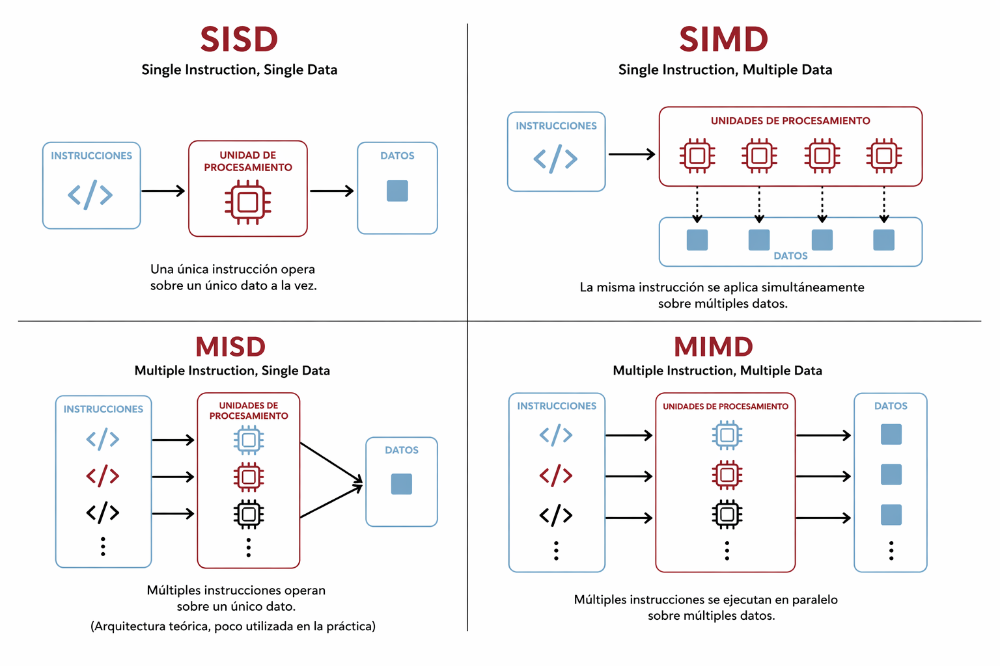
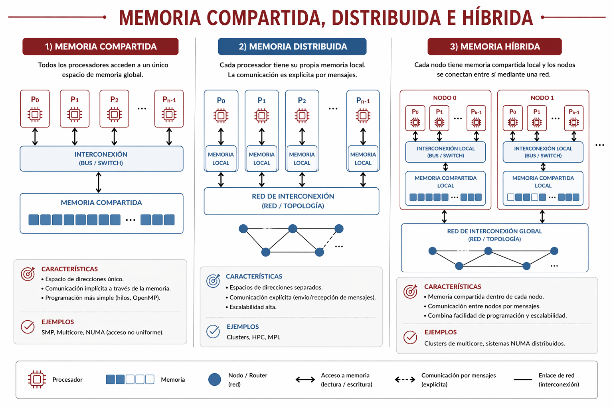

# Arquitectura y métricas

Una vez introducidos los conceptos básicos del paralelismo, conviene estudiar dos dimensiones que condicionan cualquier implementación real. Por un lado, la arquitectura disponible define cómo se organizan procesadores, memorias y mecanismos de comunicación. Por otro, las métricas permiten evaluar si una versión paralela realmente mejora el desempeño o si solo agrega complejidad y costo.

Estas dos dimensiones no deben analizarse por separado. Una misma estrategia de programación puede comportarse de manera muy distinta según el tipo de memoria, la jerarquía de caché, el costo de sincronización o el ancho de banda disponible.

## Objetivos del capítulo

- presentar clasificaciones básicas de plataformas de cómputo paralelo;
- distinguir memoria compartida, memoria distribuida y modelos híbridos;
- formalizar las nociones de speed-up y eficiencia;
- introducir leyes y conceptos que explican los límites de escalabilidad;
- relacionar jerarquía de memoria y rendimiento observado.

## Clasificación por mecanismo de control

Una clasificación clásica de las arquitecturas paralelas es la taxonomía de Flynn. Este esquema organiza las plataformas según la relación entre flujo de instrucciones y flujo de datos. Aunque se trata de una clasificación histórica, sigue siendo útil para introducir diferencias fundamentales entre tipos de procesamiento.

- SISD: una única secuencia de instrucciones opera sobre un único flujo de datos. Corresponde al modelo secuencial tradicional. Un ejemplo representativo sería una computadora mononúcleo clásica ejecutando un programa secuencial, o incluso un microcontrolador simple que resuelve una tarea en una única línea de ejecución.
- SIMD: una misma instrucción se aplica en paralelo sobre múltiples datos. Este esquema resulta especialmente relevante para vectorización, procesamiento de imágenes y muchas operaciones internas de las GPU. Como ejemplo, pueden pensarse las extensiones vectoriales de procesadores modernos, como SSE o AVX en CPU, o una GPU cuando aplica la misma operación sobre miles de píxeles o elementos de un tensor.
- MISD: múltiples instrucciones actúan sobre un mismo flujo de datos. Se mantiene sobre todo como categoría teórica y tiene escasa presencia en sistemas de propósito general. Cuando se lo ilustra con ejemplos, suele recurrirse a ciertos sistemas de control tolerantes a fallos, donde varias unidades procesan la misma entrada con lógicas distintas para aumentar confiabilidad, aunque no se trate de un modelo habitual en computadoras de uso general.
- MIMD: múltiples instrucciones operan sobre múltiples datos. Es la categoría más común en computación paralela de propósito general y abarca desde procesadores multicore hasta numerosos sistemas distribuidos. Una notebook o una PC actual con varios núcleos ya responde a este esquema, y también lo hacen un servidor multiprocesador o un clúster donde distintos nodos ejecutan tareas diferentes sobre datos distintos.

En términos generales, SIMD resulta adecuado cuando hay gran regularidad en los datos y la operación aplicada es la misma. MIMD, en cambio, ofrece mayor flexibilidad y permite abordar problemas con tareas heterogéneas, dependencias más complejas o estrategias de sincronización variadas.



## Clasificación por organización física

Otra clasificación central atiende al modo en que se organiza la memoria del sistema. Este criterio es decisivo porque modifica tanto la forma de programar como el costo de la comunicación.

En sistemas de memoria compartida, varios núcleos o procesadores acceden a un mismo espacio de direcciones. Esto simplifica el intercambio de datos, pero exige coordinar accesos concurrentes y controlar problemas de sincronización.

En sistemas de memoria distribuida, cada nodo posee memoria propia. Los datos no se comparten automáticamente y deben enviarse de manera explícita entre procesos o máquinas. Esta organización aparece con frecuencia en clústeres y entornos de cómputo científico.

También existen modelos híbridos, en los que cada nodo tiene memoria compartida local pero se comunica con otros nodos como si formara parte de un sistema distribuido. Este esquema es habitual en servidores modernos y en numerosos clústeres de alto rendimiento.

Esta distinción ayuda a anticipar decisiones de diseño. Como se verá más adelante, la elección de una estrategia de paralelización suele estar condicionada por la arquitectura. Herramientas como OpenMP se ajustan de manera natural a memoria compartida, mientras que MPI responde mejor a memoria distribuida. En modelos híbridos, ambas estrategias suelen combinarse.



## Jerarquía de memoria y localidad

En arquitectura paralela no alcanza con conocer la cantidad de cores. También importa cómo acceden a los datos. La memoria principal es mucho más lenta que los registros y las memorias caché, por lo que el rendimiento depende en gran medida de la capacidad de reutilizar datos cercanos en tiempo o en espacio.


La localidad temporal aparece cuando un dato utilizado recientemente vuelve a usarse en poco tiempo. Si una variable, una fila de una matriz o un bloque de datos acaba de cargarse en caché y el programa la necesita nuevamente enseguida, es más probable que ese acceso pueda resolverse sin volver a buscar la información en memoria principal. Dicho de forma simple, la localidad temporal mejora cuando un programa reutiliza pronto aquello que ya usó.

La localidad espacial aparece cuando, al acceder a una posición de memoria, es probable que pronto se necesiten posiciones cercanas. Esto ocurre, por ejemplo, al recorrer un vector de manera secuencial: después de leer un elemento, suelen leerse los siguientes, que están almacenados en direcciones contiguas. Como la caché transfiere datos en bloques o líneas, aprovechar posiciones vecinas aumenta la probabilidad de obtener un acierto de caché y reduce el costo de acceso.

En programación paralela esta cuestión es especialmente importante porque dos implementaciones con el mismo número de hilos pueden rendir de forma muy distinta según cómo recorran los datos. A veces, reorganizar un arreglo o cambiar el orden de recorrido mejora más que agregar workers, justamente porque mejora la localidad y reduce fallos de caché. Más adelante, cuando se estudie la multiplicación de matrices, aparecerá un ejemplo representativo: trabajar con una versión transpuesta de una de las matrices puede volver más regular el acceso a memoria y mejorar el aprovechamiento de caché, aun cuando el algoritmo siga realizando la misma cantidad de operaciones aritméticas.

## False sharing y NUMA

Un problema frecuente en memoria compartida es el false sharing. Ocurre cuando dos hilos modifican variables distintas que, sin embargo, residen en la misma línea de caché. Aunque cada hilo trabaje sobre un dato diferente, el hardware interpreta que ambos compiten por la misma región de memoria y fuerza invalidaciones o recargas innecesarias. El resultado es una degradación de rendimiento que puede ser importante aun cuando el algoritmo parezca correctamente paralelizado.

Un ejemplo simple ayuda a verlo. Supóngase un arreglo de contadores donde cada hilo actualiza una posición distinta, por ejemplo `counters[0]`, `counters[1]`, `counters[2]` y `counters[3]`. A primera vista no habría conflicto, porque cada hilo escribe en una variable diferente. Sin embargo, si esas posiciones quedan alojadas en una misma línea de caché, cada escritura puede invalidar la copia observada por otros núcleos. El programa sigue siendo correcto desde el punto de vista lógico, pero el rendimiento cae porque el hardware debe sincronizar constantemente esa región de memoria.

Identificar esta situación no siempre es sencillo, porque el error no suele aparecer como un fallo visible del programa. Más bien se manifiesta como una pérdida de rendimiento difícil de explicar: al aumentar la cantidad de hilos, el tiempo no mejora como se esperaba o incluso empeora, aun cuando el reparto de trabajo parezca razonable. Una señal típica es que el problema disminuya si se separan físicamente los datos, por ejemplo dejando espacio adicional entre contadores o asignando a cada hilo bloques más grandes y menos entremezclados de memoria.

Otro concepto clave es NUMA, sigla de Non-Uniform Memory Access. En este tipo de arquitectura, todos los núcleos pueden acceder a toda la memoria, pero no con la misma latencia. Cada procesador o grupo de núcleos tiene memoria local de acceso más rápido y memoria remota de acceso más costoso. Por ese motivo, en plataformas NUMA la ubicación de los datos influye directamente sobre el rendimiento.

También aquí conviene pensar en un ejemplo. Si un proceso o un conjunto de hilos corre principalmente en un socket del sistema, pero los datos que utiliza fueron reservados en memoria asociada a otro socket, buena parte de los accesos serán remotos. El programa puede seguir funcionando sin errores, pero con tiempos sensiblemente peores que los esperados, porque una parte importante del costo se desplaza hacia la comunicación con memoria no local.

En la práctica, una situación NUMA suele sospecharse cuando el rendimiento cambia de manera notable según dónde se ejecuten los hilos o cómo se distribuyan los datos, aun manteniendo el mismo algoritmo. Si una implementación mejora al fijar afinidad de hilos, al inicializar datos desde el mismo conjunto de núcleos que luego los usa o al reducir accesos remotos, es razonable pensar que la arquitectura NUMA está influyendo sobre el resultado. En este tipo de plataformas, no alcanza con repartir tareas: también conviene preguntarse cerca de qué procesador quedaron ubicados los datos.

False sharing y NUMA muestran una idea central: el paralelismo real no depende solo de repartir trabajo, sino también de cómo ese trabajo interactúa con la memoria física.

## Speed-up

El speed-up mide cuánto mejora el tiempo de ejecución de un programa al pasar de una versión secuencial a una versión paralela. Si se llama $T_s$ al tiempo secuencial y $T_p$ al tiempo paralelo usando $p$ procesadores, entonces:

$$
S(p) = \frac{T_s}{T_p}
$$

Si una implementación secuencial tarda 24 segundos y la paralela 6 segundos, el speed-up es 4. Este valor indica que la versión paralela ejecuta el trabajo cuatro veces más rápido que la secuencial de referencia.

Sin embargo, el speed-up rara vez es lineal. En un escenario ideal, duplicar la cantidad de procesadores duplicaría la velocidad. En la práctica aparecen costos de creación de tareas, comunicación, sincronización, acceso a memoria y balanceo desigual de carga. Por ese motivo, un aumento en $p$ no garantiza un crecimiento proporcional de $S(p)$.

## Eficiencia

La eficiencia relaciona el speed-up con la cantidad de procesadores utilizados. Permite estimar cuánto del paralelismo disponible se está aprovechando efectivamente.

$$
E(p) = \frac{S(p)}{p}
$$

En este libro se expresará siempre en porcentaje. Por lo tanto, conviene escribir:

$$
E(p) = \frac{S(p)}{p} \times 100
$$

En condiciones normales, una eficiencia del 100% representa un escalamiento lineal ideal. Valores menores indican que una parte del potencial paralelo se pierde en sobrecargas o en secciones no paralelizables.

$$
E(4) = \frac{5}{4} \times 100 = 125\%
$$

Este resultado indica un caso de eficiencia superlineal, algo que puede ocurrir ocasionalmente cuando la versión paralela aprovecha mejor la jerarquía de memoria, reduce fallos de caché o reorganiza los datos de una manera más favorable que la versión secuencial. Este tipo de situaciones puede aparecer cuando, además del paralelismo, la versión mejorada aprovecha mejor la jerarquía de memoria, reduce fallos de caché, utiliza vectorización o reorganiza el acceso a los datos de una manera más favorable que la versión secuencial. Para resumir, una eficiencia superior al 100% no es un error, sino una señal de que la versión paralela (o con la combinación de mejoras aplicadas) ha logrado un rendimiento mejor que el esperado por el simple hecho de usar más procesadores.

## Un ejemplo numérico de escalamiento

La siguiente tabla muestra un caso hipotético de escalamiento fuerte para un programa cuyo tiempo secuencial es 100 segundos.

| Procesadores $p$ | Tiempo paralelo $T_p$ | Speed-up $S(p)$ | Eficiencia $E(p)$ |
|---|---:|---:|---:|
| 1 | 100 s | 1.00 | 100% |
| 2 | 55 s | 1.82 | 91% |
| 4 | 32 s | 3.13 | 78% |
| 8 | 22 s | 4.55 | 57% |
| 16 | 18 s | 5.56 | 35% |

La tabla permite observar dos fenómenos. En primer lugar, el tiempo sigue disminuyendo al agregar procesadores. En segundo lugar, la eficiencia cae de manera sostenida. Esto muestra que la implementación mejora, pero lo hace con rendimientos decrecientes. Justamente esa diferencia entre acelerar y escalar bien es uno de los ejes centrales del análisis de performance.

## Ley de Amdahl

La ley de Amdahl formaliza el límite del speed-up cuando una parte del programa debe ejecutarse en forma secuencial. Si se llama $\alpha$ a la fracción secuencial del programa, el speed-up máximo con $p$ procesadores se expresa como:

$$
S_{A}(p) = \frac{1}{\alpha + \frac{1-\alpha}{p}}
$$

Si el 10% del programa es inevitablemente secuencial, es decir $\alpha = 0.1$, con 8 procesadores se obtiene:

$$
S_{A}(8) = \frac{1}{0.1 + \frac{0.9}{8}} = \frac{1}{0.2125} \approx 4.71
$$

Incluso con una cantidad muy grande de procesadores, el límite teórico estaría dado por:

$$
\lim_{p \to \infty} S_{A}(p) = \frac{1}{\alpha}
$$

En este ejemplo, el máximo teórico sería 10. Esta ley es valiosa porque muestra que el cuello de botella no desaparece por agregar hardware: una fracción secuencial pequeña puede imponer un techo fuerte al rendimiento.

## Ley de Gustafson

La ley de Gustafson ofrece otra perspectiva. En lugar de suponer un problema de tamaño fijo, plantea que al aumentar la cantidad de procesadores también puede crecer el tamaño del problema resuelto en un tiempo razonable. Su formulación habitual es:

$$
S_{G}(p) = p - \alpha (p - 1)
$$

Si nuevamente se toma $\alpha = 0.1$ y $p = 8$:

$$
S_{G}(8) = 8 - 0.1(7) = 7.3
$$

Mientras Amdahl enfatiza los límites del escalamiento con tamaño fijo, Gustafson ayuda a pensar por qué el paralelismo sigue siendo útil cuando el objetivo no es solo acelerar una tarea pequeña, sino resolver problemas más grandes en tiempos aceptables.

## Memory bound y compute bound

No todos los programas están limitados por el mismo recurso. Un problema compute bound dedica la mayor parte del tiempo al cálculo aritmético. En estos casos, disponer de más capacidad de cómputo suele traducirse en mejoras significativas.

Un problema memory bound, en cambio, está dominado por el costo de mover datos entre memoria y procesadores. Aquí el cuello de botella no está en la cantidad de operaciones, sino en la velocidad con que pueden leerse y escribirse datos.

Una suma simple sobre un vector muy grande suele acercarse a un comportamiento memory bound: cada elemento requiere poco cálculo y mucho movimiento de datos. En cambio, la multiplicación densa de matrices tiende a ser más compute bound, porque reutiliza datos y realiza muchas operaciones por cada acceso a memoria. Esta diferencia ayuda a entender por qué algunas tareas escalan mejor que otras, aun cuando ambas estén correctamente paralelizadas.

Una comparación mínima en Python permite fijar esta diferencia:

```python
total = 0.0
for value in values:
	total += value
```

En este caso, cada iteración hace poco cálculo por cada dato leído. El costo de acceder a memoria pesa mucho en el tiempo total.

```python
for i in range(n):
	for j in range(n):
		for k in range(n):
			c[i, j] += a[i, k] * b[k, j]
```

Aquí la situación es distinta: cada acceso a los datos participa en muchas operaciones aritméticas. Aunque este ejemplo introductorio no agota el análisis, ayuda a ver por qué una tarea puede estar más limitada por memoria o más limitada por cómputo.

## Modelo Roofline

El modelo Roofline ofrece una forma sintética de relacionar capacidad de cómputo y ancho de banda de memoria. Su idea central es que el rendimiento máximo de un programa queda limitado por dos techos: uno dado por la potencia de cálculo del procesador y otro por la velocidad con que los datos pueden llegar desde memoria.

En términos introductorios, el modelo permite distinguir si una implementación está frenada por cómputo o por memoria. Si la intensidad aritmética del programa es baja, es probable que el ancho de banda sea el factor dominante. Si es alta, el límite puede pasar a ser la capacidad de cálculo. Este marco será útil más adelante para interpretar resultados experimentales de CPU, vectorización y GPU.


## Cierre de la unidad

Con todos estos elementos, resulta más claro por qué una implementación paralela puede comportarse por debajo de lo esperado. El problema puede estar en una fracción secuencial importante, en exceso de sincronización, en mala localidad de caché, en false sharing, en accesos remotos sobre arquitectura NUMA o en saturación del ancho de banda de memoria.

Por ese motivo, medir no consiste solo en registrar tiempos. También implica interpretar qué parte de la arquitectura está imponiendo el límite. Ese vínculo entre estructura del hardware y rendimiento observado es el núcleo del análisis de performance en sistemas paralelos.

Este capítulo presentó una base más rigurosa para evaluar plataformas paralelas. A partir de ahora ya no alcanza con afirmar que un programa usa varios hilos o varios procesos: también conviene preguntar sobre qué arquitectura corre, qué costos de memoria introduce y hasta dónde puede escalar razonablemente.

En el próximo capítulo se estudiarán modelos de programación paralela. Esa transición permitirá pasar desde la arquitectura y las métricas hacia estrategias de diseño concretas para organizar tareas, datos y comunicación.

## Ejercicios del capítulo

- Describa las categorías principales de la taxonomía de Flynn y señale en qué casos resultan más relevantes SIMD y MIMD.
- Explique la diferencia entre memoria compartida, memoria distribuida y modelo híbrido.
- Defina localidad temporal y localidad espacial.
- Explique con sus palabras qué problema intenta describir la ley de Amdahl.
- Distinga problemas memory bound y compute bound.
- Explique por qué el modelo Roofline ayuda a interpretar la diferencia entre una implementación limitada por memoria y otra limitada por cómputo.
- Calcule el speed-up de un programa que tarda 24 segundos en forma secuencial y 6 segundos en forma paralela.
- Calcule la eficiencia del caso anterior si se usaron 4 procesadores.
- Suponga que la fracción secuencial de un programa es 0.2. Calcule el speed-up máximo teórico según Amdahl para 8 procesadores.
- Interprete la siguiente situación: al pasar de 8 a 16 procesadores, el tiempo baja poco y la eficiencia cae con fuerza.
- Proponga una situación en la que el rendimiento de un programa paralelo pueda verse afectado por accesos remotos en una arquitectura NUMA o por false sharing, y explique brevemente cuál sería el problema.
