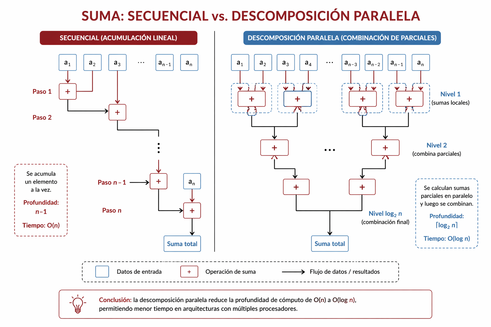

# Paralelismo en Python

En este libro, Python funciona como lenguaje de trabajo para experimentar con conceptos de programación paralela. La elección no implica desconocer la importancia de lenguajes como C, que siguen siendo fundamentales cuando se busca control fino sobre memoria, hilos y cercanía con el hardware. Sin embargo, para un recorrido introductorio conviene priorizar una herramienta que permita concentrarse primero en los conceptos centrales del paralelismo sin agregar toda la complejidad sintáctica y operativa de un lenguaje de más bajo nivel.

Esta decisión también responde a una consideración formativa y laboral. Python constituye una herramienta especialmente útil porque aparece con frecuencia en tareas de automatización, análisis de datos, desarrollo de servicios, integración de sistemas y procesamiento de información. Su presencia en contextos académicos, científicos y profesionales vuelve especialmente valioso usarlo como lenguaje de trabajo para introducir estrategias de paralelización sin exigir una especialización inmediata en desarrollo de sistemas de bajo nivel.

Además, Python ocupa hoy un lugar central en inteligencia artificial, aprendizaje automático, ciencia de datos y cómputo científico. Bibliotecas como NumPy, Numba, PyTorch, JAX o TensorFlow forman parte del ecosistema con el que actualmente se construyen desde prototipos experimentales hasta sistemas productivos. Por ese motivo, trabajar con Python en este libro no solo facilita la comprensión de los fundamentos, sino que también conecta esos fundamentos con herramientas y problemas frecuentes en contextos académicos y profesionales reales.

## Objetivos del capítulo

- presentar herramientas de Python útiles para explorar paralelismo en CPU;
- comparar enfoques basados en hilos, procesos y compilación JIT;
- relacionar cada estrategia con el tipo de problema que conviene resolver;
- señalar las limitaciones del lenguaje y sus implicancias prácticas;
- introducir errores frecuentes de concurrencia y criterios básicos de diagnóstico.

## Qué permite comparar Python

En el resto del libro, Python resulta especialmente útil porque permite contrastar estrategias diferentes sobre problemas similares sin cambiar de entorno de trabajo en cada paso. Con relativa facilidad puede pasarse de una versión secuencial a una versión con hilos, otra con procesos y una versión compilada con Numba. Esa continuidad vuelve más visible qué cambia realmente cuando se modifica la forma de expresar el cálculo y, más adelante, también facilita extender la misma lógica hacia otros niveles de abstracción.

Esta posibilidad comparativa tiene un valor didáctico importante. Ayuda a ver que el paralelismo no es una técnica única, sino un conjunto de decisiones sobre partición de datos, coordinación, costo de ejecución y nivel de abstracción. Justamente por eso Python funciona aquí menos como un fin en sí mismo que como una plataforma conveniente para observar, medir y contrastar estrategias distintas sobre una misma familia de problemas.

## Herramientas centrales de este capítulo

Antes de entrar en ejemplos concretos, conviene ordenar qué herramientas ocuparán el centro del capítulo. Aquí el foco estará puesto sobre todo en `threading`, `multiprocessing`, pools o executors y Numba en CPU. Se trata de herramientas distintas, pero todas permiten examinar una misma pregunta: cómo pasar de una versión secuencial en Python a variantes más eficientes cuando el problema exige trabajo intensivo de CPU o una mejor organización del cálculo.

- `threading` y sus variantes permiten trabajar con concurrencia basada en hilos;
- `multiprocessing` crea procesos independientes y evita la restricción principal del GIL para tareas intensivas de CPU;
- Numba compila funciones Python y puede acercar el rendimiento al de implementaciones más cercanas al hardware sin abandonar el lenguaje de trabajo.

Más adelante se retomarán otras estrategias de optimización sobre arreglos y tensores, pero en este punto conviene concentrarse en estas herramientas porque constituyen una base importante para entender el paralelismo explícito en CPU.

## Limitaciones de Python para paralelismo

Uno de los puntos centrales aquí es el Global Interpreter Lock, conocido como GIL. Se trata de una limitación relevante en la implementación tradicional de Python, ya que condiciona la ejecución simultánea de hilos dentro de un mismo intérprete. Por ese motivo, no siempre alcanza con crear múltiples threads para obtener una mejora real en tareas intensivas de CPU.

Conviene agregar una precisión importante. Desde Python 3.13 existe la posibilidad experimental de compilar una variante sin GIL, en el marco de los cambios recientes del intérprete. Sin embargo, esa opción todavía no constituye la modalidad estándar de uso y sigue en una etapa de adopción y maduración. Por ese motivo, en este libro se trabaja con la versión oficial y estable de Python tal como se utiliza de manera habitual, es decir, con GIL habilitado. Más adelante, a medida que estas variantes se consoliden, será razonable revisar este punto en futuras versiones del material.

En términos prácticos, esto significa que los hilos en Python suelen ser adecuados para tareas I/O-bound, como leer archivos, esperar respuestas de red o interactuar con dispositivos. En cambio, para tareas CPU-bound, como sumar grandes arreglos, procesar imágenes o calcular modelos, el GIL limita la ganancia esperable si se usan hilos convencionales.

Comprender esta limitación es fundamental para interpretar correctamente los resultados experimentales. Un programa con muchos threads puede parecer más complejo o más paralelo y, sin embargo, rendir igual o peor que una versión secuencial si el problema está dominado por cálculo puro. En cambio, cuando se trabaja con procesos independientes, cada uno dispone de su propio intérprete y puede ejecutar cálculo en paralelo sin quedar restringido por el mismo GIL, aunque a costa de introducir mayores costos de creación, serialización y comunicación.

## Threads y procesos: qué cambia en Python y qué cambia respecto de C

En Python conviene distinguir con claridad entre threads y procesos porque no representan solo dos maneras de lanzar trabajo, sino también dos modelos distintos de memoria y de costo. Los threads comparten el mismo espacio de memoria del proceso y, dentro de Python, también comparten el mismo intérprete. Eso vuelve más simple el acceso a datos comunes, pero introduce la restricción del GIL en la implementación habitual del lenguaje. Los procesos, en cambio, tienen memoria separada y cada uno cuenta con su propio intérprete, de modo que pueden ejecutar cálculo en paralelo real sobre varios núcleos, aunque compartir datos entre ellos resulte más costoso.

Desde el punto de vista práctico, esta diferencia explica por qué los threads suelen convenir en tareas I/O-bound y los procesos en tareas CPU-bound. Si un thread pasa gran parte del tiempo esperando una respuesta de red, una lectura de disco o la llegada de datos desde otro sistema, el costo del GIL pesa menos y la concurrencia sigue siendo útil. Si el trabajo consiste en cálculo sostenido, la situación cambia: varios threads de Python pueden alternar sobre un mismo intérprete sin traducirse en una aceleración proporcional. Con procesos, en cambio, el paralelismo puede aprovechar mejor los cores disponibles, pero aparece un costo adicional al copiar, serializar o coordinar datos entre espacios de memoria separados.

La comparación con C ayuda a precisar todavía más esta idea. En C, bibliotecas como Pthreads también trabajan con hilos dentro de un mismo proceso y con memoria compartida, pero no existe una restricción equivalente al GIL del intérprete estándar de Python. Por ese motivo, en C los threads suelen ser una herramienta natural tanto para concurrencia como para paralelismo CPU-bound, siempre que la sincronización esté bien resuelta. Python conserva parte de esa lógica de memoria compartida cuando se usan threads, pero agrega una capa de ejecución interpretada que modifica el resultado esperado. Dicho de forma simple, en C la pregunta principal suele ser cómo sincronizar hilos sin errores; en Python también hay que preguntar si conviene usar hilos o si el problema exige pasar a procesos, vectorización o compilación.

Si en el futuro una variante sin GIL se vuelve la modalidad oficial y dominante de Python, esta distinción entre threads y process no perderá sentido, aunque probablemente cambie de énfasis. Los threads podrían ganar relevancia también para tareas CPU-bound, porque dejarían de arrastrar la restricción principal que hoy condiciona su rendimiento. Sin embargo, seguiría siendo importante diferenciarlos de los procesos: ambos modelos no solo se distinguen por su capacidad de cómputo, sino también por el modo en que comparten memoria, se aíslan entre sí, gestionan fallos y asumen costos de coordinación. Dicho de otro modo, un Python sin GIL volvería menos tajante la oposición actual entre threads para entrada/salida y procesos para cálculo intensivo, pero no eliminaría la necesidad de elegir entre memoria compartida e intérpretes aislados según la estructura real del problema.

## Patrones básicos para paralelizar loops en Python

Uno de los usos más comunes del paralelismo en Python consiste en transformar un loop secuencial en una ejecución repartida entre workers. Conviene, entonces, ordenar primero los patrones más habituales con los que suele plantearse esa transformación.

### Creación manual de workers

La forma más explícita consiste en crear un hilo o un proceso por tarea. Este enfoque es pedagógicamente útil porque muestra con claridad qué significa lanzar trabajo independiente, iniciar workers y esperar su finalización.

Un patrón mínimo con hilos podría escribirse así:

```python
from threading import Thread


def task(value):
	print(value * value)


if __name__ == "__main__":
	threads = [Thread(target=task, args=(i,)) for i in range(4)]

	for thread in threads:
		thread.start()

	for thread in threads:
		thread.join()
```

Y un patrón equivalente con procesos podría expresarse de este modo:

```python
from multiprocessing import Process


def task(value):
	print(value * value, flush=True)


if __name__ == "__main__":
	processes = [Process(target=task, args=(i,)) for i in range(4)]

	for process in processes:
		process.start()

	for process in processes:
		process.join()
```

Estas versiones son claras, pero no escalan bien cuando hay muchas tareas pequeñas. Crear un worker por iteración introduce un overhead considerable y, además, dificulta la recuperación ordenada de resultados.

### Pools y executors

Cuando la tarea consiste en aplicar la misma función muchas veces con diferentes entradas, conviene reutilizar un conjunto fijo de workers. Ahí aparecen los pools y los executors.

Un ejemplo con `ProcessPoolExecutor` permite ver el patrón moderno más útil para tareas CPU-bound:

```python
from concurrent.futures import ProcessPoolExecutor


def task(value):
	return value * value


if __name__ == "__main__":
	with ProcessPoolExecutor() as executor:
		results = list(executor.map(task, range(8)))

	print(results)
```

Para tareas I/O-bound, una estructura análoga con `ThreadPoolExecutor` suele ser más natural. La diferencia importante no está solo en la sintaxis, sino en el tipo de problema para el cual cada executor resulta apropiado.

En términos prácticos, los executors suelen ser preferibles a la creación manual masiva porque reutilizan workers, simplifican la recolección de resultados y expresan mejor la intención del programa.

## Secuencial, procesos y Numba sobre problemas clásicos

Para comparar estrategias conviene partir de un problema pequeño y homogéneo. Un ejemplo típico es recorrer un vector y acumular resultados. En versión secuencial, el patrón es simple:



```python
def sum_elements(values):
	total = 0
	for value in values:
		total += value
	return total
```

Si se intenta resolver este mismo problema con `threading`, puede que el rendimiento no mejore en tareas CPU-bound debido al GIL. Con `multiprocessing`, en cambio, es posible repartir bloques entre procesos distintos y combinar subtotales. Una versión conceptual mínima podría verse así:

```python
from multiprocessing import Pool


def partial_sum(values):
	total = 0
	for value in values:
		total += value
	return total


if __name__ == "__main__":
	chunks = [list(range(0, 250000)), list(range(250000, 500000))]

	with Pool(processes=2) as pool:
		partials = pool.map(partial_sum, chunks)

	print(sum(partials))
```

La idea importante es que la ganancia no proviene solo de usar una biblioteca diferente, sino de haber repartido los datos y de aceptar el costo de serialización y sincronización entre procesos.

Una lógica análoga puede usarse para multiplicar matrices si el trabajo se divide por bloques de filas. En este caso conviene partir primero de una versión secuencial breve, porque eso vuelve más clara la transición hacia las variantes paralelas.

```python
def matmul_sequential(matrix_a, matrix_b):
	result = []
	for row in matrix_a:
		result_row = []
		for j in range(len(matrix_b[0])):
			total = 0
			for k in range(len(matrix_b)):
				total += row[k] * matrix_b[k][j]
			result_row.append(total)
		result.append(result_row)
	return result
```

Si luego se reparte el trabajo por bloques de filas, cada proceso recibe un subconjunto de filas de la matriz `A`, calcula su bloque de salida usando la matriz `B` y luego los bloques parciales se reensamblan en la matriz resultado.

```python
from multiprocessing import Pool


def multiply_block(block, matrix_b):
	result = []
	for row in block:
		result_row = []
		for j in range(len(matrix_b[0])):
			total = 0
			for k in range(len(matrix_b)):
				total += row[k] * matrix_b[k][j]
			result_row.append(total)
		result.append(result_row)
	return result


if __name__ == "__main__":
	matrix_a = [
		[0, 1, 2],
		[3, 4, 5],
		[6, 7, 8],
		[9, 10, 11],
	]
	matrix_b = [
		[0, 1],
		[2, 3],
		[4, 5],
	]
	row_blocks = [matrix_a[:2], matrix_a[2:]]

	with Pool(processes=2) as pool:
		partial_blocks = pool.starmap(
			multiply_block,
			[(block, matrix_b) for block in row_blocks],
		)

	matrix_c = []
	for block in partial_blocks:
		matrix_c.extend(block)
```

Aquí reaparece una idea central del capítulo: paralelizar no consiste solo en repartir operaciones, sino también en decidir cómo particionar los datos y cómo recomponer luego el resultado total.

Con Numba, el mismo problema puede atacarse desde otra lógica: en lugar de coordinar múltiples procesos desde Python, se compila el cálculo y se deja que la biblioteca optimice la ejecución.

```python
from numba import njit, prange


@njit(parallel=True)
def sum_numba(values):
	total = 0.0
	for index in prange(len(values)):
		total += values[index]
	return total
```

Este enfoque es especialmente importante en el libro porque conecta con OpenMP a nivel conceptual y permite contrastar una estrategia basada en compilación con otras basadas en workers explícitos.

La misma lógica puede extenderse a una multiplicación de matrices escrita de manera explícita:

```python
from numba import njit, prange


@njit(parallel=True)
def matmul_numba(matrix_a, matrix_b):
	rows = len(matrix_a)
	inner = len(matrix_b)
	cols = len(matrix_b[0])
	result = [[0.0 for _ in range(cols)] for _ in range(rows)]

	for i in prange(rows):
		for j in range(cols):
			total = 0.0
			for k in range(inner):
				total += matrix_a[i][k] * matrix_b[k][j]
			result[i][j] = total

	return result
```

En este caso, el paralelismo aparece al repartir el cálculo de filas de la matriz resultado. La estructura del algoritmo sigue siendo clara, pero el costo del problema ya no está solo en acumular valores, sino en coordinar muchas operaciones sobre dos estructuras bidimensionales.

## Un caso práctico transversal: Sobel en CPU

Además de los ejemplos más clásicos, conviene introducir un problema que acompañará el resto del recorrido del libro: la detección de bordes mediante el operador de Sobel.

En términos generales, Sobel aplica máscaras de convolución sobre una imagen en escala de grises para estimar cambios de intensidad en direcciones horizontal y vertical. A partir de esas respuestas parciales puede construirse una imagen de bordes. Desde el punto de vista del paralelismo, se trata de un caso útil porque trabaja sobre datos bidimensionales, exige recorrer vecinos y permite comparar con claridad distintas maneras de expresar un mismo cálculo.


Una formulación secuencial mínima puede escribirse así:

```python
def sobel_sequential(image):
	kernel_x = [
		[-1, 0, 1],
		[-2, 0, 2],
		[-1, 0, 1],
	]
	kernel_y = [
		[-1, -2, -1],
		[0, 0, 0],
		[1, 2, 1],
	]

	height = len(image)
	width = len(image[0])
	result = [[0.0 for _ in range(width)] for _ in range(height)]

	for row in range(1, height - 1):
		for col in range(1, width - 1):
			gx = 0.0
			gy = 0.0
			for kr in range(3):
				for kc in range(3):
					pixel = image[row + kr - 1][col + kc - 1]
					gx += pixel * kernel_x[kr][kc]
					gy += pixel * kernel_y[kr][kc]
			result[row][col] = abs(gx) + abs(gy)

	return result
```

Esta versión deja ver con claridad la lógica básica del problema: para cada posición interior de la imagen, se toman vecinos cercanos, se aplican dos máscaras y luego se combinan los resultados parciales. También permite advertir por qué se trata de un problema intensivo en CPU cuando la imagen crece, ya que el cálculo debe repetirse para una gran cantidad de píxeles.

Una primera aceleración razonable consiste en conservar la misma lógica general, pero compilarla con Numba sobre CPU:

```python
from numba import njit, prange


@njit(parallel=True)
def sobel_numba(image):
	kernel_x = (
		(-1, 0, 1),
		(-2, 0, 2),
		(-1, 0, 1),
	)
	kernel_y = (
		(-1, -2, -1),
		(0, 0, 0),
		(1, 2, 1),
	)

	height = len(image)
	width = len(image[0])
	result = [[0.0 for _ in range(width)] for _ in range(height)]

	for row in prange(1, height - 1):
		for col in range(1, width - 1):
			gx = 0.0
			gy = 0.0
			for kr in range(3):
				for kc in range(3):
					pixel = image[row + kr - 1][col + kc - 1]
					gx += pixel * kernel_x[kr][kc]
					gy += pixel * kernel_y[kr][kc]
			result[row][col] = abs(gx) + abs(gy)

	return result
```

En este punto no hace falta desarrollar una comparación experimental detallada. Sin embargo, sí conviene señalar una expectativa general: cuando el tamaño de la imagen es suficientemente grande, se espera que una versión compilada con Numba CPU reduzca de manera sustancial el tiempo de ejecución respecto de la versión secuencial escrita solo con loops de Python.

## Cómo elegir una estrategia

Antes de escribir código conviene responder una pregunta simple: ¿el problema está limitado por entrada y salida o por cálculo?

- si el problema es I/O-bound, los hilos suelen ser una opción razonable;
- si el problema es CPU-bound, los procesos o herramientas como Numba suelen ser mejores alternativas;
- si el trabajo consiste en aplicar operaciones repetitivas sobre arreglos numéricos, conviene evaluar primero vectorización, que se verá en próximos capítulos;
- si se necesita acelerar código Python sin reescribir todo el algoritmo en otro lenguaje, Numba funciona como un puente especialmente útil.

## Errores frecuentes al paralelizar en Python

Hasta aquí el capítulo se concentró en elegir bibliotecas y patrones. Sin embargo, al paralelizar también aparecen errores específicos que conviene reconocer desde una etapa introductoria.

Uno de los más conocidos es la race condition. Aparece cuando varios hilos o procesos acceden a un mismo dato compartido sin coordinación suficiente y el resultado depende del orden efectivo de ejecución. En esos casos, el programa puede producir salidas distintas entre una ejecución y otra.

En memoria compartida, una actualización aparentemente simple como incrementar un contador puede volverse problemática si no se protege adecuadamente. Conceptualmente, el problema no está en la suma en sí, sino en que leer, modificar y escribir no siempre constituye una operación atómica.

Otro riesgo importante es el deadlock. Ocurre cuando dos o más tareas quedan esperando recursos entre sí y ninguna puede avanzar. En Python, este problema puede aparecer al combinar locks, colas, joins o recursos compartidos en un orden incorrecto.

En un nivel introductorio, conviene quedarse con tres señales de alerta:

- resultados no deterministas cuando se reutilizan datos compartidos;
- programas que terminan más lentamente de lo esperado sin mejorar con más workers;
- ejecuciones que quedan bloqueadas o no finalizan.

Reconocer estos síntomas es importante porque no todo problema de paralelismo es un problema de rendimiento. A veces el código falla primero en corrección y solo después en velocidad.

## Una mirada inicial al debugging y profiling

En este contexto, debugging y profiling nombran dos prácticas complementarias. El debugging busca detectar y explicar errores de corrección, por ejemplo resultados inconsistentes, bloqueos o comportamientos no esperados. El profiling, en cambio, se orienta a observar cómo se consume el tiempo de ejecución y qué partes del programa concentran el costo principal. En problemas paralelos, ambas miradas suelen necesitarse al mismo tiempo, porque una implementación puede fallar por coordinación incorrecta o funcionar bien desde el punto de vista lógico pero rendir mucho peor de lo esperado.

Debuggear programas paralelos exige observar más que el resultado final. En Python conviene empezar por preguntas sencillas:

- ¿los workers están haciendo trabajo real o permanecen ociosos?;
- ¿el tiempo de ejecución se concentra en el cómputo o en crear procesos, mover datos o sincronizar?;
- ¿el uso de CPU se distribuye entre varios cores o sigue concentrado en uno solo?;
- ¿las salidas cambian entre ejecuciones equivalentes?

Una primera aproximación razonable consiste en medir tiempos con cuidado, observar la carga de CPU del sistema y contrastar resultados entre distintas configuraciones. Ese tipo de observación ya alcanza para detectar muchos errores de diseño, por ejemplo tareas demasiado pequeñas para justificar procesos o uso de threads en problemas claramente CPU-bound.

Por ese motivo, profiling y debugging deben leerse aquí como prácticas de observación básica: medir, comparar, repetir y buscar explicaciones consistentes para el comportamiento del programa.

## Una tabla de síntesis del capítulo

| Estrategia | Conviene usarla cuando | Ventaja principal | Límite principal |
|---|---|---|---|
| Versión secuencial | el problema es pequeño o se necesita una línea de base clara | simplicidad y facilidad de inspección | no aprovecha varios cores |
| `threading` | el trabajo es I/O-bound o la coordinación entre tareas pesa más que el cálculo | bajo costo de coordinación y modelo directo de concurrencia | el GIL limita su utilidad en tareas CPU-bound |
| `multiprocessing` | el problema es CPU-bound y puede dividirse en bloques independientes | paralelismo real entre procesos y evita el GIL | serialización, copia de datos y mayor overhead |
| Numba CPU | se quiere acelerar cálculo numérico sin salir de Python | compilación JIT y mejor aprovechamiento de CPU | exige código compatible y no reemplaza toda estrategia de partición |

## Ejercicios del capítulo

- Compare tareas I/O-bound y CPU-bound en relación con `threading` y `multiprocessing`.
- Distinga una race condition de un problema de rendimiento.
- Diseñe una tabla de resultados para comparar una versión secuencial, una versión con threads, una versión con procesos y una versión con Numba de un mismo problema.
- Proponga un problema I/O-bound y otro CPU-bound, e indique qué estrategia usaría en cada caso.
- Describa una situación en la que un programa paralelo en Python podría quedar bloqueado o producir resultados no deterministas.
- Justifique cuál de las siguientes estrategias elegiría para un problema de suma de grandes arreglos numéricos: `threading`, `multiprocessing` o Numba.
- Redacte una reflexión breve sobre por qué una implementación más paralela en apariencia puede no ser la más rápida en Python.
- Explique qué observaría primero para diagnosticar por qué una versión paralela no mejora respecto de la secuencial.