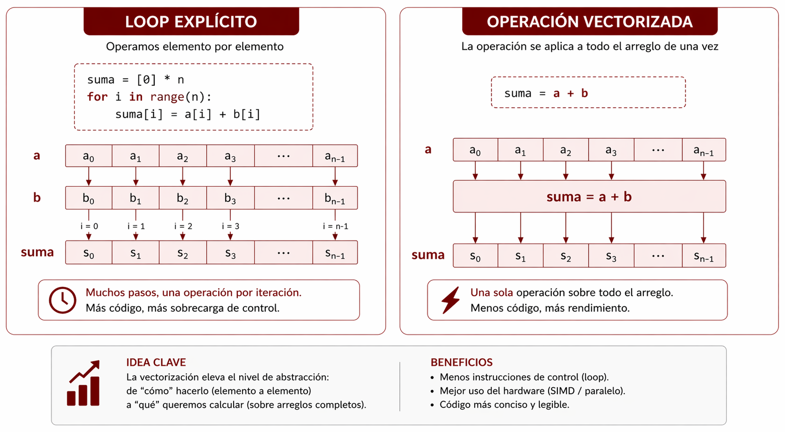
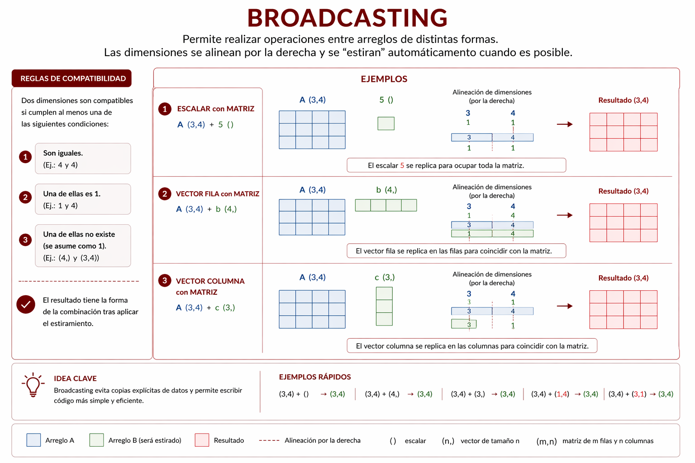
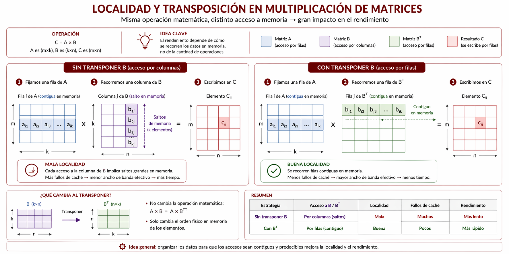
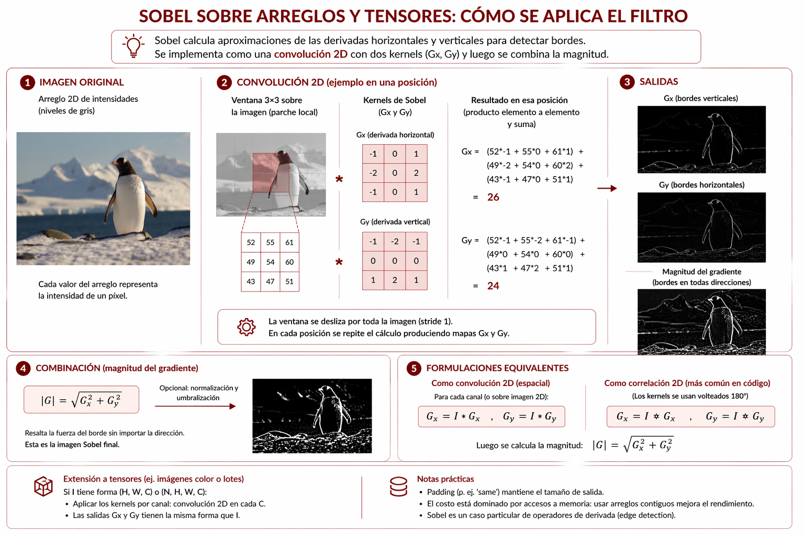

# Vectorización, broadcasting y optimización sobre arreglos

Después de estudiar hilos, procesos y compilación JIT sobre CPU, conviene introducir otra idea central para el rendimiento: muchas mejoras no provienen de crear workers explícitos, sino de reformular el cálculo. En problemas numéricos regulares, el cambio decisivo suele consistir en dejar de pensar en iteraciones individuales y pasar a operar sobre arreglos o tensores completos.

Este cambio de formulación reduce la sobrecarga del intérprete, aprovecha bibliotecas implementadas en bajo nivel y suele mejorar la relación entre cómputo y acceso a memoria. Por ese motivo, la vectorización y el broadcasting no deben leerse como meras definiciones aisladas, sino como parte de una estrategia de optimización sobre CPU.

## Objetivos del capítulo

- definir vectorización y broadcasting en un nivel introductorio;
- explicar por qué reformular un cálculo puede ser más efectivo que paralelizarlo de manera explícita;
- relacionar estas técnicas con SIMD, con NumPy y con la organización de datos en memoria;
- introducir tensores en PyTorch CPU como continuidad conceptual del trabajo sobre arreglos;
- retomar el caso de Sobel para mostrar cómo un mismo problema puede reescribirse sobre arreglos y tensores completos.

## Planteo del capítulo

En el capítulo anterior se estudiaron estrategias donde el programador decide de forma visible cómo repartir trabajo entre threads, procesos o regiones paralelas compiladas con Numba. Aquí el foco cambia. La pregunta central ya no es cómo crear workers, sino cómo expresar el mismo problema de una forma que el entorno pueda ejecutar de manera más eficiente.

En términos generales, esta diferencia separa dos estrategias complementarias. El paralelismo explícito distribuye tareas. La reformulación sobre arreglos cambia el nivel de abstracción del cálculo. En muchos problemas regulares, esta segunda vía produce mejores resultados sobre CPU precisamente porque evita parte del overhead de coordinación y aprovecha implementaciones optimizadas.

## Qué es la vectorización

La vectorización consiste en aplicar operaciones sobre estructuras completas de datos, como vectores o matrices, en lugar de recorrer elemento por elemento mediante bucles explícitos en Python. Esta estrategia se apoya en implementaciones optimizadas de bajo nivel y en capacidades del hardware asociadas con SIMD, es decir, la ejecución de una misma instrucción sobre múltiples datos.

En términos prácticos, vectorizar significa reemplazar una lógica del tipo "para cada elemento, hacer una operación" por una expresión que opera sobre todo el arreglo de una vez. La operación conceptual puede ser la misma, pero el costo de ejecución cambia porque ya no se depende del intérprete de Python para administrar cada iteración individual.

Una comparación mínima permite verlo con claridad. Si se quiere sumar dos vectores `a` y `b`, una formulación explícita con un bucle en Python podría ser:

```python
result = []
for i in range(len(a)):
	result.append(a[i] + b[i])
```

Frente a una formulación vectorizada:

```python
import numpy as np

result = np.array(a) + np.array(b)
```

La segunda versión no es solo más breve. También es más eficiente porque delega el cálculo a una implementación optimizada.

Algo análogo puede verse con multiplicación de matrices. Una formulación explícita exige recorrer filas, columnas y productos parciales:

```python
result = []
for i in range(len(a)):
	row = []
	for j in range(len(b[0])):
		total = 0
		for k in range(len(b)):
			total += a[i][k] * b[k][j]
		row.append(total)
	result.append(row)
```

Frente a una formulación vectorizada:

```python
import numpy as np

result = np.array(a) @ np.array(b)
```

Aquí también aparece el cambio de nivel de abstracción: en lugar de describir cada multiplicación y cada suma parcial, se expresa directamente la operación matricial completa y se deja la ejecución en manos de una biblioteca optimizada.



## SIMD como fundamento

SIMD, sigla de Single Instruction, Multiple Data, permite que una misma operación actúe simultáneamente sobre varios elementos. Esta idea resulta especialmente adecuada para tareas repetitivas sobre grandes conjuntos de datos, como procesamiento de imágenes, audio, video, simulaciones físicas y entrenamiento de modelos de inteligencia artificial.

Conviene notar que SIMD no es lo mismo que vectorización, aunque ambas ideas estén muy relacionadas. SIMD es una capacidad de hardware o de bajo nivel. La vectorización es una forma de expresar el cálculo de modo tal que ese hardware pueda aprovecharse. Dicho de otro modo, la vectorización suele ser la puerta de entrada de alto nivel a comportamientos cercanos a SIMD.

## Qué es el broadcasting

El broadcasting es un conjunto de reglas que permite combinar arreglos de distinto tamaño cuando sus dimensiones son compatibles según ciertos criterios. En lugar de expandir manualmente los datos o escribir bucles adicionales, la biblioteca aplica la operación como si ciertos valores se difundieran sobre la estructura mayor.

Un caso elemental es sumar un escalar a todos los elementos de un vector:

```python
import numpy as np

values = np.array([1, 2, 3])
result = values + 5
```

Aquí el valor `5` actúa como si se replicara sobre todas las posiciones del arreglo, aunque esa expansión no se escriba manualmente. El interés del broadcasting está justamente en evitar código adicional y permitir expresiones compactas sobre estructuras compatibles.

También puede aparecer en operaciones entre matrices y vectores, por ejemplo cuando se desea sumar un vector fila a todas las filas de una matriz. Este patrón es muy frecuente en procesamiento de imágenes, normalización de datos y cálculo científico.



## Relación entre vectorización y broadcasting

Vectorización y broadcasting suelen aparecer juntas. La primera se refiere a operar sobre arreglos completos; la segunda, a compatibilizar dimensiones para que esa operación sea posible sin trabajo manual adicional. Aunque se las confunda con frecuencia, conviene distinguirlas porque responden a problemas diferentes.

La vectorización responde a la pregunta "cómo evitar iterar elemento por elemento". El broadcasting responde a la pregunta "cómo combinar estructuras de distinta forma sin escribir lógica adicional para expandirlas".

## El lugar de NumPy

Antes de paralelizar bucles en Python, conviene considerar una alternativa muchas veces más efectiva: eliminar el bucle explícito. NumPy permite expresar operaciones sobre arreglos completos mediante vectorización. En problemas numéricos regulares, esta estrategia suele superar a muchas soluciones basadas en threads o procesos, justamente porque reduce la sobrecarga del intérprete y aprovecha implementaciones de bajo nivel optimizadas.

Por ejemplo, si el objetivo es sumar dos vectores, una formulación vectorizada como la siguiente suele ser preferible a un loop Python paralelizado manualmente:

```python
import numpy as np

a = np.array([1, 2, 3])
b = np.array([4, 5, 6])
c = a + b
```

Esta observación es central para el recorrido del libro: no todo problema repetitivo debe resolverse con hilos o procesos. En muchos casos, la optimización correcta consiste en cambiar el nivel de abstracción del cálculo.

## Reformular también es optimizar

La mejora de rendimiento asociada con vectorización no depende solo de hacer varias operaciones a la vez. También influye el modo en que los datos se organizan y se recorren en memoria. Cuando un arreglo está dispuesto de forma contigua y la operación recorre los datos con regularidad, el hardware puede aprovechar mejor la jerarquía de caché y reducir accesos costosos a memoria principal.

Aquí reaparece una idea vista al estudiar arquitectura y métricas: muchas tareas con arreglos grandes están limitadas por memoria más que por cálculo puro. En esos casos, escribir el problema de forma vectorizada puede mejorar tanto la expresión del cálculo como el patrón de acceso a memoria.

Esto explica por qué una implementación vectorizada puede superar a otra más "paralela" en apariencia. Si la segunda introduce overhead de coordinación entre hilos o procesos, o recorre peor los datos, la ventaja de repartir trabajo entre varios workers puede evaporarse rápidamente.

## Un ejemplo de localidad: matrices y transposición

La multiplicación de matrices ofrece un caso útil para observar esta idea. Si una matriz se recorre por filas pero la otra se consulta columna por columna, el patrón de acceso puede volverse menos regular. Una manera de mejorar la localidad consiste en transponer previamente una de las matrices para que ambos recorridos se hagan sobre datos dispuestos de forma más conveniente.

Una formulación explícita básica puede escribirse así:

```python
def matmul_sequential(matrix_a, matrix_b):
	rows = len(matrix_a)
	inner = len(matrix_b)
	cols = len(matrix_b[0])
	result = [[0.0 for _ in range(cols)] for _ in range(rows)]

	for i in range(rows):
		for j in range(cols):
			total = 0.0
			for k in range(inner):
				total += matrix_a[i][k] * matrix_b[k][j]
			result[i][j] = total

	return result
```

Si primero se transpone `matrix_b`, el cálculo interno puede reescribirse para recorrer dos filas y no una fila junto con una columna:

```python
def transpose(matrix):
	return [list(row) for row in zip(*matrix)]


def matmul_with_transposed_b(matrix_a, matrix_b):
	matrix_b_t = transpose(matrix_b)
	rows = len(matrix_a)
	cols = len(matrix_b_t)
	result = [[0.0 for _ in range(cols)] for _ in range(rows)]

	for i in range(rows):
		row_a = matrix_a[i]
		for j in range(cols):
			row_b_t = matrix_b_t[j]
			total = 0.0
			for k in range(len(row_a)):
				total += row_a[k] * row_b_t[k]
			result[i][j] = total

	return result
```

El algoritmo sigue siendo secuencial y mantiene la misma complejidad asintótica. Lo que cambia es la forma de recorrer los datos. Este ejemplo es importante porque muestra que optimizar no siempre significa agregar paralelismo explícito. A veces significa reorganizar los datos para que el acceso a memoria sea más regular.



Con NumPy, esa misma reformulación puede expresarse de modo más directo:

```python
import numpy as np

matrix_a = np.array(matrix_a, dtype=np.float64)
matrix_b = np.array(matrix_b, dtype=np.float64)
matrix_b_t = matrix_b.T

matrix_c = matrix_a @ matrix_b
matrix_c_alt = np.empty((matrix_a.shape[0], matrix_b_t.shape[0]), dtype=np.float64)

for i in range(matrix_a.shape[0]):
	for j in range(matrix_b_t.shape[0]):
		matrix_c_alt[i, j] = np.dot(matrix_a[i], matrix_b_t[j])
```

En este caso, el cálculo sigue apoyándose en una biblioteca optimizada, pero la reformulación vuelve a hacerse visible: al trabajar con la matriz ya transpuesta, cada producto interno se expresa entre filas. Lo importante aquí no es la sintaxis puntual, sino la idea de que la organización de datos y la forma de expresar el cálculo condicionan el rendimiento.

## Broadcasting como técnica puntual de reformulación

Un ejemplo cercano a usos reales aparece al normalizar columnas de una matriz. Si se quiere restar a cada columna su media, una primera formulación secuencial con bucles explícitos podría escribirse así:

```python
matrix = [
	[1.0, 10.0, 100.0],
	[2.0, 20.0, 200.0],
	[3.0, 30.0, 300.0],
]

column_means = [
	sum(row[column] for row in matrix) / len(matrix)
	for column in range(len(matrix[0]))
]

centered = []
for row in matrix:
	centered_row = []
	for column in range(len(row)):
		centered_row.append(row[column] - column_means[column])
	centered.append(centered_row)
```

En cambio, una formulación vectorizada con broadcasting puede escribirse así:

```python
import numpy as np

matrix = np.array([
	[1.0, 10.0, 100.0],
	[2.0, 20.0, 200.0],
	[3.0, 30.0, 300.0],
])

# axis=0 indica que la media se calcula columna por columna
column_means = matrix.mean(axis=0)
centered = matrix - column_means
```

Aquí no hace falta expandir manualmente `column_means` para cada fila. El broadcasting aplica la resta como si ese vector se replicara sobre toda la matriz. Comparado con la versión secuencial, cambia el nivel de abstracción y desaparece la necesidad de administrar el recorrido en Python.

## Tensores en CPU: continuidad con PyTorch

Hasta aquí el eje estuvo puesto en NumPy, que sigue siendo la herramienta principal de este capítulo. Sin embargo, conviene introducir una continuidad conceptual importante: muchos de estos mismos problemas también pueden expresarse sobre tensores en PyTorch, aun cuando la ejecución siga ocurriendo en CPU.

Desde un punto de vista introductorio, un tensor puede pensarse como una generalización de arreglos multidimensionales. En CPU, PyTorch permite trabajar con tensores y operaciones sobre bloques completos de datos de una forma cercana a NumPy. La diferencia relevante para el recorrido del libro es que esta formulación servirá luego como puente natural hacia GPU.

Una suma simple de tensores en CPU puede verse así:

```python
import torch

a = torch.tensor([1.0, 2.0, 3.0], device="cpu")
b = torch.tensor([4.0, 5.0, 6.0], device="cpu")
c = a + b
```

También puede reaparecer el broadcasting:

```python
import torch

matrix = torch.tensor([
	[1.0, 10.0, 100.0],
	[2.0, 20.0, 200.0],
	[3.0, 30.0, 300.0],
], device="cpu")

column_means = matrix.mean(dim=0)
centered = matrix - column_means
```

La lógica conceptual es la misma que en NumPy: operar sobre estructuras completas y dejar el detalle de muchas optimizaciones en manos de la biblioteca.

## Un caso práctico transversal: Sobel con arreglos y tensores

En el capítulo anterior se presentó Sobel en una versión secuencial y luego en una variante acelerada con Numba CPU. Ahora conviene retomar el mismo problema desde otra pregunta: cómo reescribir ese cálculo para operar sobre arreglos o tensores completos, en lugar de administrar manualmente cada píxel desde Python.



Si se parte de una imagen en escala de grises almacenada como arreglo bidimensional, una formulación con NumPy puede construirse a partir de cortes que representan las nueve posiciones de cada vecindad `3 x 3`:

```python
import numpy as np


def sobel_numpy(image):
	image = np.asarray(image, dtype=np.float32)
	result = np.zeros_like(image)

	top_left = image[:-2, :-2]
	top = image[:-2, 1:-1]
	top_right = image[:-2, 2:]
	left = image[1:-1, :-2]
	right = image[1:-1, 2:]
	bottom_left = image[2:, :-2]
	bottom = image[2:, 1:-1]
	bottom_right = image[2:, 2:]

	gx = (
		-top_left + top_right
		- 2.0 * left + 2.0 * right
		- bottom_left + bottom_right
	)
	gy = (
		-top_left - 2.0 * top - top_right
		+ bottom_left + 2.0 * bottom + bottom_right
	)

	result[1:-1, 1:-1] = np.abs(gx) + np.abs(gy)
	return result
```

La idea importante aquí no es memorizar la fórmula, sino observar la reformulación. El problema deja de expresarse como una doble iteración sobre píxeles y pasa a escribirse como una combinación de subarreglos que representan vecinos alineados.

Esa misma lógica puede trasladarse a tensores en PyTorch CPU sin recurrir todavía a primitivas de convolución ya resueltas. Una versión con tensores y operaciones explícitas puede escribirse así:

```python
import torch


def sobel_torch_cpu(image):
	image = torch.as_tensor(image, dtype=torch.float32, device="cpu")
	result = torch.zeros_like(image)

	top_left = image[:-2, :-2]
	top = image[:-2, 1:-1]
	top_right = image[:-2, 2:]
	left = image[1:-1, :-2]
	right = image[1:-1, 2:]
	bottom_left = image[2:, :-2]
	bottom = image[2:, 1:-1]
	bottom_right = image[2:, 2:]

	gx = (
		-top_left + top_right
		- 2.0 * left + 2.0 * right
		- bottom_left + bottom_right
	)
	gy = (
		-top_left - 2.0 * top - top_right
		+ bottom_left + 2.0 * bottom + bottom_right
	)

	result[1:-1, 1:-1] = torch.abs(gx) + torch.abs(gy)
	return result
```

En esta variante, el cálculo sigue ocurriendo sobre CPU, pero ya se lo formula sobre tensores. Esa continuidad es importante porque prepara el cambio de dispositivo que se estudiará en el próximo capítulo. Lo nuevo allí no será la idea de tensor en sí misma, sino su ejecución sobre GPU y las consecuencias que eso trae en términos de transferencias, kernels y jerarquía de memoria del acelerador.

## Criterios para el análisis práctico

Para estudiar estas técnicas con mayor profundidad conviene comparar implementaciones con bucles explícitos frente a versiones vectorizadas, observar cómo cambian las dimensiones de los arreglos en operaciones con broadcasting y relacionar esas transformaciones con los tiempos de ejecución obtenidos.

En particular, conviene revisar al menos estas preguntas:

- ¿la operación puede escribirse sobre arreglos completos o depende de lógica muy irregular?;
- ¿los datos tienen una forma compatible con broadcasting o requieren reestructuración previa?;
- ¿la ganancia observada proviene de menos iteraciones en Python, de mejor acceso a memoria o de ambas cosas?;
- ¿la organización de datos favorece accesos regulares a memoria o introduce recorridos poco locales?;
- ¿el problema conviene expresarlo con arreglos de NumPy o con tensores que luego puedan continuar en GPU?

Estas preguntas permiten leer los resultados con más cuidado y evitar la idea simplista de que cualquier paralelización explícita será superior a una formulación vectorizada.

## Una tabla de síntesis del capítulo

| Estrategia | Conviene usarla cuando | Ventaja principal | Límite principal |
|---|---|---|---|
| Loop explícito en Python | el problema es pequeño, didáctico o muy irregular | control detallado del algoritmo | alto costo por iteración |
| Vectorización con NumPy | la operación es regular sobre arreglos | reduce overhead y aprovecha rutinas optimizadas | menos natural para lógica irregular |
| Broadcasting | hay que combinar estructuras compatibles de distinta forma | evita expansión manual y simplifica expresiones | requiere comprender bien las dimensiones |
| Tensores en PyTorch CPU | conviene trabajar con operaciones sobre tensores y preparar continuidad hacia GPU | misma idea de reformulación sobre CPU con puente natural a aceleradores | agrega otra biblioteca y no reemplaza por sí sola la necesidad de analizar memoria y acceso a datos |

Con este marco, el siguiente paso será estudiar qué ocurre cuando estas ideas se trasladan a GPU. La continuidad conceptual ya está instalada: el capítulo siguiente no introducirá desde cero el trabajo con tensores, sino el cambio de dispositivo y de modelo de ejecución.

## Ejercicios del capítulo

- Defina vectorización con sus palabras.
- Explique qué problema resuelve el broadcasting.
- Distinga entre vectorización, broadcasting y paralelismo explícito.
- Justifique por qué SIMD resulta relevante para estas técnicas.
- Compare conceptualmente la multiplicación de matrices secuencial con la variante que transpone una de las matrices antes del cálculo.
- Describa por qué la normalización de columnas puede expresarse de manera natural con broadcasting.
- Explique cómo se reformula Sobel en la versión con NumPy a partir de cortes sobre el arreglo original.
- Analice un problema numérico sencillo e indique si conviene resolverlo con loop explícito, vectorización con NumPy, broadcasting o tensores en PyTorch CPU. Justifique la decisión.
- Compare el papel que cumple Sobel en el capítulo 05 con el que cumple en este capítulo. Indique qué cambia en la estrategia de optimización.
- Explique por qué PyTorch CPU aparece aquí como continuidad de NumPy y no todavía como un tema centrado en GPU.
