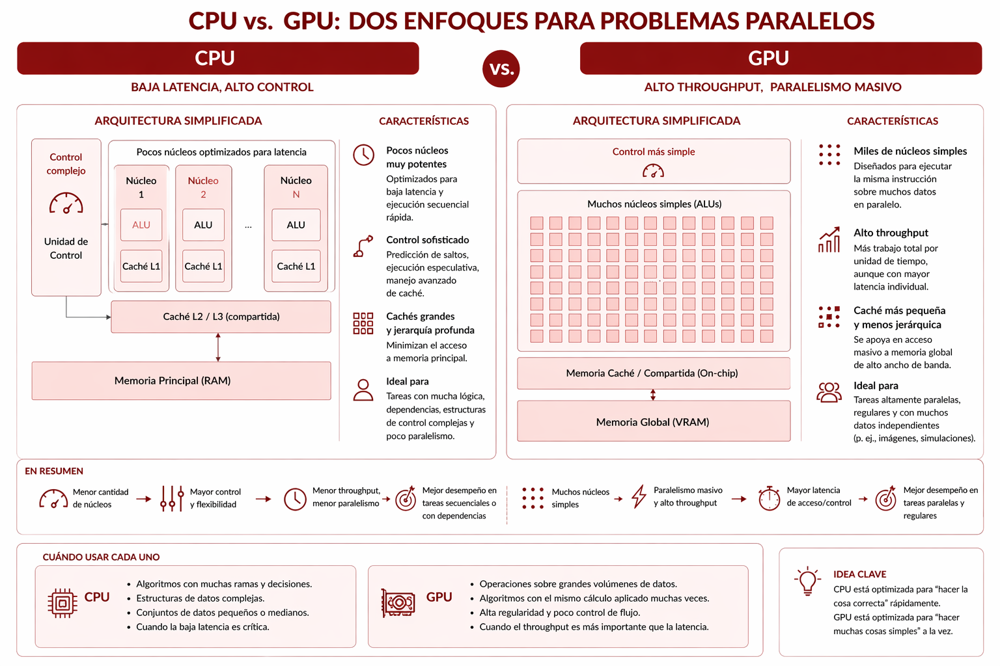
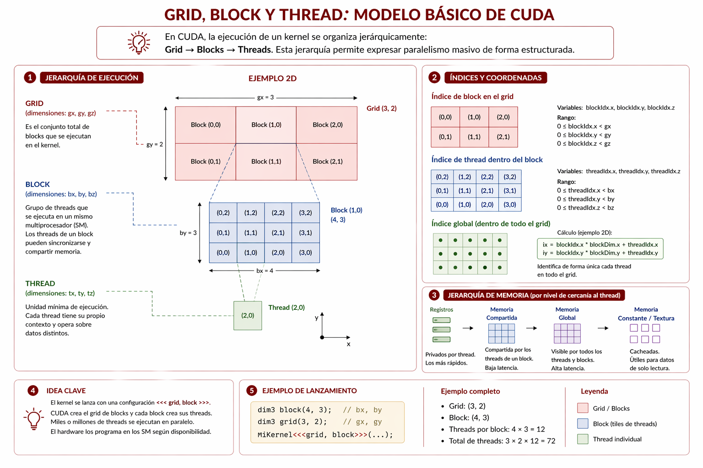

# Computación con GPU

En las últimas décadas, las unidades de procesamiento gráfico (GPU) dejaron de ser dispositivos dedicados exclusivamente al renderizado visual y pasaron a ocupar un lugar relevante en la computación paralela. Este cambio no responde solo a una evolución del hardware gráfico, sino también a una transformación más amplia en la naturaleza de los problemas computacionales contemporáneos. Cada vez con mayor frecuencia, resulta necesario aplicar la misma operación sobre grandes volúmenes de datos, ya sea en simulaciones numéricas, procesamiento de imágenes, análisis de señales o aprendizaje automático. En ese contexto, las GPU se volvieron una alternativa frecuente para este tipo de tareas.

Su importancia proviene de una arquitectura pensada para sostener una gran cantidad de operaciones similares de manera concurrente. A diferencia de una CPU, que suele privilegiar la ejecución rápida y flexible de un número más reducido de hilos complejos, una GPU organiza sus recursos para maximizar el throughput sobre tareas altamente regulares. Por ese motivo, no se trata simplemente de un procesador “más rápido”, sino de un dispositivo con una lógica de ejecución distinta, cuya ventaja aparece cuando el problema contiene suficiente paralelismo de datos.

Comprender este cambio de perspectiva resulta importante dentro del recorrido del libro. Hasta aquí se estudiaron hilos, procesos, vectorización y estrategias de paralelización en CPU. El paso hacia GPU no reemplaza esas ideas, sino que las continúa en una escala distinta. Muchas de las preguntas que ya se formularon sobre partición del trabajo, acceso a memoria y medición de rendimiento siguen siendo relevantes, aunque ahora en una arquitectura con reglas propias de organización, memoria y ejecución.

## Objetivos del capítulo

- introducir el papel de las GPU en la computación paralela contemporánea;
- presentar de manera general el modelo de ejecución de CUDA;
- explicar los principales factores que influyen en el rendimiento de un kernel;
- introducir tipos de memoria y conceptos como coalescing, occupancy y warp divergence;
- incorporar criterios básicos de debugging y profiling para kernels GPU;
- presentar PyTorch GPU como vía de acceso de alto nivel al trabajo con tensores sobre aceleradores.

## El lugar de las GPU en este recorrido

Las GPU se volvieron relevantes porque permiten ejecutar una gran cantidad de operaciones similares sobre grandes volúmenes de datos. Esta característica las hace adecuadas para problemas donde el paralelismo de datos es dominante, por ejemplo procesamiento de imágenes, simulaciones numéricas y entrenamiento de redes neuronales.

Conviene notar que esta ventaja no proviene solo de tener muchos núcleos. También depende de una arquitectura orientada a ocultar latencias, sostener alto ancho de banda de memoria y ejecutar miles de hilos ligeros sobre un mismo dispositivo. Esa lógica es diferente de la de una CPU generalista, que suele dedicar más recursos a la ejecución rápida de unos pocos hilos complejos.

## Qué caracteriza a una GPU

Una GPU dispone de una gran cantidad de núcleos especializados y de un ancho de banda de memoria muy elevado en comparación con la memoria RAM convencional. Estas características la hacen apta para tareas masivas y repetitivas sobre grandes volúmenes de datos.

En este capítulo conviene distinguir entre dos familias de GPU que responden a contextos de uso diferentes. Por un lado, una GPU de consumo como la NVIDIA GeForce RTX 4090 permite pensar el paralelismo masivo en una estación de trabajo personal. Se trata de una GPU con 16384 núcleos CUDA, 24 GB de memoria GDDR6X y un diseño orientado tanto a gráficos avanzados como a creación de contenido, desarrollo y experimentación con modelos de inteligencia artificial en escala personal.

Por otro lado, una GPU de centro de datos como la NVIDIA H100 representa otra escala de diseño y de uso. Basada en la arquitectura Hopper, incorpora Tensor Cores de cuarta generación y está pensada para entrenamiento e inferencia de modelos grandes, computación científica y análisis de datos en servidores. En sus configuraciones más difundidas ofrece 80 GB de memoria HBM3, un ancho de banda de memoria del orden de 3.35 TB/s y enlaces NVLink de hasta 900 GB/s entre GPU, rasgos que la vuelven adecuada para clústeres y sistemas multi-GPU. 

Más allá del modelo puntual, lo importante es comprender el principio general: la GPU ofrece paralelismo masivo, aunque bajo reglas de programación distintas de las de una CPU tradicional.

En términos generales, una CPU optimiza latencia y control. Una GPU optimiza throughput (rendimiento), es decir, la cantidad total de trabajo completado sobre un gran conjunto de datos. Por ese motivo, una GPU no siempre es la mejor elección para cualquier algoritmo. Su ventaja aparece cuando el problema contiene muchas operaciones similares e independientes.



Antes de pasar a los modelos de programación, conviene interpretar qué enseñan realmente estas especificaciones. La cantidad de núcleos es un dato relevante, pero no basta por sí sola para comprender el comportamiento de una GPU. También importan la memoria disponible, el ancho de banda, la posibilidad de comunicar varias GPU entre sí y, sobre todo, el tipo de carga que se quiere ejecutar. Dicho de forma simple, una GPU no se elige solo por tener “más cores”, sino por la relación entre arquitectura, memoria y clase de problema. Con este marco, resulta más claro por qué el estudio de CUDA, de la jerarquía de memoria y de la organización en threads, blocks y grids es necesario para entender cómo se aprovecha realmente este hardware.

## CUDA como modelo de programación

CUDA, sigla de Compute Unified Device Architecture, es el modelo desarrollado por NVIDIA para utilizar GPU en cálculos de propósito general. En este capítulo, la ejecución se organiza mediante tres conceptos centrales: grid, block y thread.

Los hilos se agrupan en bloques y los bloques en grillas. Esta organización permite distribuir el trabajo sobre el dispositivo y adaptar la ejecución al problema planteado. La elección de dimensiones adecuadas para bloques y grillas constituye una parte importante del diseño y del análisis de rendimiento.

Un modo simple de leer esta estructura es el siguiente:

- cada `thread` ejecuta el mismo kernel sobre una parte del problema;
- varios `threads` se agrupan en un `block`, que comparte ciertos recursos del hardware;
- el conjunto de bloques forma el `grid`, que representa la ejecución total del kernel.

En este contexto, conviene introducir una noción básica: un kernel es la función que se ejecuta sobre la GPU. A diferencia de una función secuencial tradicional, no se invoca para producir una sola trayectoria de ejecución, sino para que una gran cantidad de hilos ejecuten el mismo código sobre datos distintos. Dicho de forma simple, el kernel contiene la lógica de la operación que se quiere aplicar masivamente, mientras que la grilla y los bloques determinan cuántas veces y cómo se distribuye esa ejecución sobre el hardware.



## Alternativas a CUDA

Aunque CUDA ocupa un lugar importante en la introducción a la programación sobre GPU, no constituye la única alternativa disponible. Su ventaja pedagógica radica en que permite presentar con claridad ideas como `thread`, `block`, `grid`, jerarquía de memoria y configuración de ejecución dentro de un ecosistema muy consolidado. Sin embargo, existen otros caminos para trabajar con aceleradores, especialmente cuando se busca portabilidad entre fabricantes o un nivel de abstracción diferente.

Una familia importante de alternativas está formada por modelos más portables, como OpenCL o SYCL, que procuran ofrecer una vía de programación menos atada a un único proveedor de hardware. También existen bibliotecas y frameworks de más alto nivel, como PyTorch o JAX, que permiten expresar operaciones sobre tensores sin escribir kernels de bajo nivel en cada caso. En esos entornos, buena parte del trabajo se delega a bibliotecas optimizadas que luego se ejecutan sobre GPU cuando el hardware y el backend lo permiten.

Por ese motivo, conviene entender la elección de CUDA en este capítulo como una decisión didáctica y no como una afirmación de exclusividad. Aquí se lo utiliza porque ayuda a hacer visibles los conceptos fundamentales de la computación GPU. Más adelante, cuando aparezcan herramientas de más alto nivel, resultará más claro que muchas de ellas reutilizan estas mismas ideas, aunque las presenten con otra interfaz o con un mayor grado de abstracción.

## Un kernel mínimo con Numba

En este capítulo se introduce el uso de GPU desde Python mediante Numba. Esta estrategia resulta adecuada para el enfoque didáctico del libro, ya que permite acercarse a conceptos de GPU sin abandonar el lenguaje principal de trabajo. Al mismo tiempo, Numba conserva de manera bastante directa el modelo de ejecución asociado a CUDA: kernels, grids, blocks, threads y cálculo explícito de índices. Por ese motivo, ofrece una aproximación útil para estudiar cómo se organiza el trabajo en una GPU sin pasar de inmediato a un entorno de más bajo nivel como CUDA C o C++, ni tampoco a un entorno de más alto nivel como PyTorch donde muchos de esos detalles quedan ocultos.

Dicho de otro modo, ofrece una abstracción intermedia: reduce parte de la complejidad sintáctica, pero no oculta los conceptos fundamentales que conviene comprender en una introducción a la programación sobre GPU.

Un ejemplo mínimo, más cercano a operaciones ya vistas en capítulos anteriores, consiste en sumar dos vectores elemento a elemento:

```python
from numba import cuda


@cuda.jit
def add_vectors(a, b, result):
	# Calcula el índice global del hilo en una grilla unidimensional.
	index = cuda.grid(1)
	if index < len(result):
		result[index] = a[index] + b[index]
```

En este kernel, cada hilo calcula su índice global dentro del grid y se ocupa de una sola posición de los vectores. Si el índice es válido, lee un elemento de `a`, lee el correspondiente de `b` y escribe la suma en `result`. El interés del ejemplo no está solo en la operación elegida, sino en mostrar el patrón más básico de programación en GPU: un gran conjunto de hilos ejecuta el mismo código sobre datos distintos.

Cuando se lanza el kernel, también debe decidirse la configuración de ejecución:

```python
# Cantidad de hilos que tendrá cada bloque.
threads_per_block = 256

# Cantidad de bloques necesaria para cubrir los n elementos.
blocks_per_grid = (n + threads_per_block - 1) // threads_per_block

# Lanza el kernel sobre la GPU con esa configuración.
add_vectors[blocks_per_grid, threads_per_block](a, b, result)
```

Aquí conviene detenerse porque esta parte expresa una de las decisiones centrales de la programación GPU. `threads_per_block` indica cuántos hilos se agrupan dentro de cada bloque. En este ejemplo se elige 256, un valor frecuente en introducciones porque permite pensar una cantidad suficientemente grande de hilos por bloque sin entrar todavía en ajustes más finos de arquitectura. `blocks_per_grid`, en cambio, indica cuántos bloques harán falta para cubrir el total del problema. Si `n` representa la cantidad de elementos del vector, entonces el cálculo `(n + threads_per_block - 1) // threads_per_block` realiza, en términos prácticos, una división entera con redondeo hacia arriba.

La razón de esa fórmula es sencilla. Si hubiera exactamente 1024 elementos y cada bloque tuviera 256 hilos, alcanzarían 4 bloques. Pero si hubiera 1000 elementos, la división exacta no daría un número entero de bloques. En ese caso, también conviene reservar 4 bloques para asegurar que existan suficientes hilos como para cubrir todas las posiciones del vector. Eso significa que algunos hilos adicionales pueden quedar sin trabajo útil al final. Por ese motivo, dentro del kernel aparece la condición `if index < len(result)`: sirve para evitar que esos hilos sobrantes intenten acceder a posiciones inexistentes.

Esta lógica muestra una diferencia importante respecto de una formulación secuencial. En una CPU secuencial suele pensarse primero en el bucle y luego en el índice. En GPU, además de la operación que realiza cada hilo, hay que decidir cómo se distribuye globalmente el trabajo sobre bloques y grillas. Esa decisión influye directamente en el rendimiento porque condiciona cuántos hilos estarán disponibles, cómo se ocuparán los multiprocesadores y qué tan bien se aprovecharán los recursos del dispositivo. Elegirla bien, por lo tanto, es parte del problema de programación y no un detalle accesorio.

Conviene detenerse un momento en la anotación `@cuda.jit`. La sigla JIT significa just in time, es decir, compilación en el momento de la ejecución. En lugar de interpretar cada instrucción de Python una por una durante el cálculo, Numba traduce la función anotada a una forma ejecutable más cercana al hardware cuando esa función se utiliza. En términos generales, esta estrategia permite conservar una sintaxis accesible y, al mismo tiempo, obtener una ejecución mucho más eficiente que la de un código Python puramente interpretado.

También conviene distinguir esta anotación de otras que aparecen en Numba. `@jit` es el decorador general para compilación just in time, mientras que `@njit` equivale, en términos prácticos, a pedir compilación en modo nativo sin apoyarse en objetos de Python durante la ejecución. `@cuda.jit`, en cambio, no se usa para acelerar una función sobre CPU, sino para definir kernels y funciones asociadas al modelo de ejecución de CUDA sobre GPU. Por ese motivo, aunque los nombres se parezcan, no cumplen exactamente el mismo papel dentro del ecosistema de Numba.

## Un ejemplo bidimensional: multiplicación de matrices

La suma de vectores permite introducir el caso más simple, donde cada hilo se asocia con una única posición de un arreglo unidimensional. Un paso natural consiste en extender esa idea a un problema bidimensional, como la multiplicación de matrices. Este ejemplo resulta útil porque retoma una operación ya trabajada en capítulos anteriores y, al mismo tiempo, anticipa por qué en GPU la organización de accesos a memoria pasa a ser tan importante.

Una versión introductoria, sin optimizaciones adicionales, puede escribirse así:

```python
from numba import cuda


@cuda.jit
def matmul(a, b, result):
	row, col = cuda.grid(2)
	if row < result.shape[0] and col < result.shape[1]:
		total = 0.0
		for k in range(a.shape[1]):
			total += a[row, k] * b[k, col]
		result[row, col] = total
```

Aquí la idea general sigue siendo la misma, pero ahora cada hilo se asocia con una posición `(row, col)` de la matriz resultado. Para obtener ese par de coordenadas se usa `cuda.grid(2)`, que calcula el índice global del hilo en una grilla bidimensional. Si la posición calculada cae dentro de los límites de la matriz, el hilo recorre la dimensión interna `k`, acumula los productos parciales y finalmente escribe un único elemento del resultado.

Este ejemplo permite ver con más claridad cómo cambia la complejidad del problema. En la suma de vectores, cada hilo solo necesita leer dos valores y escribir uno. En la multiplicación de matrices, en cambio, cada hilo debe leer una fila de `a`, una columna de `b` y realizar varias operaciones antes de producir su resultado. Por ese motivo, este tipo de kernel ayuda a entender por qué más adelante será necesario prestar atención no solo a la partición del trabajo, sino también a la jerarquía de memoria, al patrón de accesos y al costo de reutilizar datos.

## Tipos de memoria en GPU

Uno de los motivos por los que dos kernels correctos pueden rendir de forma muy distinta es la jerarquía de memoria del dispositivo. En un nivel introductorio, conviene distinguir al menos estas regiones:

- memoria global: es la memoria principal de la GPU. Tiene gran capacidad, pero también una latencia relativamente alta;
- memoria compartida: es una memoria pequeña y rápida, visible para los hilos de un mismo bloque;
- memoria local: corresponde a datos privados de cada hilo, aunque puede terminar respaldada en memoria global según el uso de registros;
- memoria constante: está pensada para datos de solo lectura que se reutilizan de manera uniforme por muchos hilos.

En términos generales, una estrategia eficiente intenta minimizar accesos costosos a memoria global y reutilizar datos cuando sea posible mediante registros o memoria compartida. Esta observación conecta directamente con la jerarquía de memoria estudiada en CPU, aunque aquí adquiere todavía mayor relevancia.

## Coalescing

El coalescing describe una situación en la que hilos cercanos acceden a posiciones de memoria global cercanas entre sí. Cuando esto ocurre, el hardware puede agrupar esos accesos y utilizarlos de manera más eficiente.

Si, en cambio, cada hilo accede a posiciones dispersas o poco regulares, la GPU necesita más transacciones de memoria y el kernel pierde rendimiento. Por eso, no basta con que el trabajo esté paralelizado: también importa cómo se recorren y se distribuyen los datos.

## Warp divergence

En muchas GPU, los hilos se ejecutan internamente en grupos llamados warps. En términos simples, un warp es un conjunto de hilos que avanza de manera coordinada. Si todos siguen el mismo camino de ejecución, el hardware trabaja de forma eficiente. Si distintas ramas condicionales hacen que algunos hilos tomen un camino y otros otro, aparece la llamada warp divergence.

La divergencia no significa que el kernel esté mal, pero sí que parte del paralelismo efectivo se pierde porque el warp debe resolver caminos distintos en momentos diferentes. Por eso, en GPU conviene prestar atención a condiciones muy irregulares o a kernels donde los hilos de un mismo grupo no realizan operaciones similares.

## Occupancy

La occupancy puede entenderse, en este nivel, como la relación entre la cantidad de hilos activos en un multiprocesador de la GPU y la cantidad máxima que ese multiprocesador podría sostener. Una occupancy alta suele ayudar a ocultar latencias de memoria, porque mientras algunos hilos esperan datos otros pueden seguir ejecutándose.

Sin embargo, una occupancy alta no garantiza por sí sola un mejor rendimiento. Si el kernel usa demasiados registros, demasiada memoria compartida o presenta malos accesos a memoria, el desempeño puede seguir siendo pobre. Por ese motivo, la occupancy debe leerse como un indicador útil, pero no como un objetivo absoluto.

## Configuración del kernel y rendimiento observado

Uno de los problemas prácticos más importantes al trabajar con GPU consiste en elegir la configuración de `threadsperblock` y `blockspergrid`. Si el bloque es demasiado pequeño, puede desaprovechar recursos. Si es demasiado grande, puede limitar la cantidad de bloques activos o generar presión excesiva sobre registros y memoria compartida.

Por ese motivo, dos decisiones de configuración pueden producir tiempos muy distintos aun cuando el kernel sea exactamente el mismo. Esto explica por qué el ajuste de parámetros forma parte del análisis de performance y no debe tratarse como una elección arbitraria.

En términos introductorios, conviene quedarse con esta idea: el rendimiento en GPU depende de la interacción entre cómputo, memoria y configuración de ejecución. No alcanza con que el código "corra en la GPU".

## PyTorch sobre GPU

Después de la aproximación con Numba, conviene pasar a una vía de más alto nivel. En este punto ya no hace falta presentar desde cero la idea de tensor, porque ese trabajo se introdujo en el capítulo anterior. Lo nuevo aquí es el dispositivo: cómo se trasladan tensores a un acelerador, cómo se ejecutan allí las operaciones y por qué el costo total de una solución GPU depende no solo del cómputo, sino también de las transferencias.

Desde el punto de vista pedagógico, este pasaje muestra otra escala de abstracción. Con Numba, el foco está en kernels, índices y configuración de ejecución. Con PyTorch GPU, en cambio, el foco se desplaza hacia el trabajo sobre tensores y hacia la decisión de dónde se ejecuta el cálculo. El cambio no invalida lo anterior: permite contrastar dos niveles de trabajo sobre el mismo tipo de hardware.

En entornos reales, esta segunda vía tiene un papel importante en aprendizaje automático, procesamiento de imágenes y cálculo numérico sobre tensores. Muchas aplicaciones no escriben kernels a mano, sino que delegan gran parte de la ejecución a bibliotecas optimizadas que internamente aprovechan la GPU.

## Dispositivo, transferencias y costo total

Un punto central al trabajar con PyTorch consiste en elegir el dispositivo de ejecución. En una introducción conviene concentrarse en los casos más habituales:

- `cpu`, para ejecución sobre procesador generalista;
- `cuda`, para GPU NVIDIA;
- `mps`, para GPU de Apple en entornos compatibles.

Habitualmente se centraliza la elección del dispositivo en un solo lugar:

```python
import torch

if torch.cuda.is_available():
	device = "cuda"
elif torch.backends.mps.is_available():
	device = "mps"
else:
	device = "cpu"
```

Esto permite conservar la misma estructura general del código y cambiar solo el lugar donde viven los tensores. Una operación simple sobre GPU puede escribirse así:

```python
import torch

values = torch.tensor([1.0, 2.0, 3.0, 4.0], device=device)
result = values * 2 + 1
```

La operación es casi idéntica a la vista en CPU. Lo que cambia es el dispositivo donde se ejecuta. Esta continuidad constituye una de las principales ventajas de las bibliotecas de alto nivel: permiten mantener una interfaz estable mientras el backend decide cómo aprovechar el acelerador.

También puede hacerse explícito el movimiento entre host y dispositivo:

```python
import torch

values = torch.tensor([1.0, 2.0, 3.0, 4.0])

if device != "cpu":
	gpu_values = values.to(device)
	gpu_result = gpu_values * 2 + 1
	result_back_on_cpu = gpu_result.to("cpu")
```

Aquí aparecen con claridad tres momentos distintos: datos en CPU, cómputo en GPU y devolución del resultado al host. Esta secuencia es importante porque una implementación acelerada no debe evaluarse solo por el tiempo del cálculo puro. Si la transferencia domina el tiempo total, la mejora esperada puede reducirse mucho o incluso desaparecer.

La misma lógica puede verse en una multiplicación de matrices:

```python
import torch

m1 = torch.tensor([[1.0, 2.0], [3.0, 4.0]], device=device)
m2 = torch.tensor([[5.0, 6.0], [7.0, 8.0]], device=device)
matrix_result = m1 @ m2
```

La notación sigue siendo la misma que en CPU, pero ahora el cálculo puede delegarse al acelerador. Este tipo de continuidad explica por qué PyTorch GPU ocupa un lugar tan importante en flujos contemporáneos de aprendizaje profundo y procesamiento numérico intensivo.

## Numba CUDA y PyTorch GPU

Conviene comparar brevemente ambos enfoques para no confundir sus papeles dentro del libro.

| Herramienta | Nivel de abstracción | Conviene usarla cuando | Lo que deja ver con más claridad |
|---|---|---|---|
| Numba CUDA | más cercano al kernel y a CUDA | interesa entender cómo se distribuye trabajo en threads, blocks y grids | organización interna de la ejecución GPU |
| PyTorch GPU | más cercano a tensores y operaciones de alto nivel | el problema ya se expresa como cálculo sobre tensores y se quiere usar un acelerador sin escribir kernels manuales | continuidad entre tensores y aceleración sobre GPU |

Esta comparación ayuda a ubicar mejor el sentido pedagógico del capítulo. Numba CUDA permite entender cómo funciona la GPU de forma más cercana al hardware. PyTorch GPU muestra cómo muchas aplicaciones reales acceden a ese mismo hardware desde un nivel de abstracción mayor.

## Continuidad del caso práctico transversal: Sobel con PyTorch GPU

Después de haber trabajado Sobel en CPU con Numba y luego sobre arreglos y tensores en CPU, conviene retomar ahora el mismo problema desde la lógica del acelerador. En este punto, el interés principal no está en redefinir el operador desde cero, sino en observar qué cambia cuando la misma formulación sobre tensores se ejecuta en GPU.


Una versión con PyTorch GPU puede escribirse así:

```python
import torch


def sobel_torch_gpu(image, device):
	image = torch.as_tensor(image, dtype=torch.float32, device=device)
	result = torch.zeros_like(image)

	top_left = image[:-2, :-2]
	top = image[:-2, 1:-1]
	top_right = image[:-2, 2:]
	left = image[1:-1, :-2]
	right = image[1:-1, 2:]
	bottom_left = image[2:, :-2]
	bottom = image[2:, 1:-1]
	bottom_right = image[2:, 2:]

	gx = (
		-top_left + top_right
		- 2.0 * left + 2.0 * right
		- bottom_left + bottom_right
	)
	gy = (
		-top_left - 2.0 * top - top_right
		+ bottom_left + 2.0 * bottom + bottom_right
	)

	result[1:-1, 1:-1] = torch.abs(gx) + torch.abs(gy)
	return result
```

La estructura del cálculo resulta familiar porque sigue la misma reformulación sobre tensores ya presentada en el capítulo anterior. Lo nuevo es que ahora esos tensores viven en el dispositivo acelerador. Esto permite ver con claridad el sentido de la progresión del libro: primero se estudió el problema de forma secuencial y compilada sobre CPU, luego se lo reformuló sobre arreglos y tensores, y ahora esa misma formulación se ejecuta sobre GPU.

También conviene señalar un límite importante. El hecho de que una versión GPU exista no implica automáticamente que siempre sea preferible. Si la imagen es pequeña o si el costo de mover datos domina el tiempo total, la mejora puede no justificar el cambio de dispositivo. En cambio, cuando el volumen de datos crece o el cálculo se encadena con otras operaciones que ya permanecen en GPU, la aceleración puede resultar mucho más significativa.

Este mismo criterio permite proyectar el ejemplo hacia una continuidad natural: si en lugar de una sola imagen se trabaja con secuencias de cuadros, el problema se acerca al procesamiento de video. Esa proyección no necesita desarrollarse aquí por completo, pero sí ayuda a ver cómo el caso práctico transversal puede escalar hacia escenarios de mayor volumen de datos.

## Qué conviene observar al analizar una implementación GPU

Al estudiar o medir un kernel, conviene observar al menos estas cuestiones:

- si el problema tiene suficiente paralelismo de datos como para justificar el uso de la GPU;
- si los accesos a memoria global son regulares o dispersos;
- si los hilos de un mismo warp siguen trayectorias de ejecución similares;
- si la configuración de bloques e hilos parece razonable para el tamaño del problema;
- si el costo de copiar datos entre CPU y GPU no anula la mejora obtenida en el cómputo;
- si el cálculo permanece en GPU lo suficiente como para amortizar las transferencias.

Estas preguntas ayudan a interpretar resultados experimentales y a evitar una expectativa ingenua según la cual cualquier cálculo será automáticamente más rápido por ejecutarse en GPU.

## Debugging y profiling en GPU

En GPU, una parte importante del trabajo consiste en distinguir entre un kernel incorrecto y un kernel correcto pero ineficiente. Ese diagnóstico requiere una forma de observación algo diferente de la que se usa en CPU, porque aquí intervienen también copias de datos entre host y dispositivo, configuración de ejecución y patrones de acceso a memoria.

Una primera recomendación consiste en separar conceptualmente tres tiempos distintos:

- el tiempo de preparación y copia de datos hacia la GPU;
- el tiempo de ejecución del kernel;
- el tiempo de devolución de resultados al host.

Si no se distinguen estas etapas, una medición puede llevar a conclusiones engañosas. Un kernel muy rápido puede parecer lento si el volumen de transferencia domina el tiempo total.

En una medición básica con Numba, además, conviene sincronizar explícitamente antes de detener el reloj, ya que la ejecución puede ser asincrónica:

```python
import time
from numba import cuda


start = time.time()
kernel[blocks_per_grid, threads_per_block](values)
cuda.synchronize()
elapsed = time.time() - start
```

Sin esa sincronización, el tiempo medido puede no reflejar la ejecución real del kernel.

Desde el punto de vista del debugging, conviene observar al menos estos síntomas:

- resultados incorrectos por índices mal calculados o límites mal controlados;
- kernels que funcionan pero rinden poco por accesos no coalesced;
- configuraciones de bloques que reducen occupancy o desaprovechan el dispositivo;
- tiempos dominados por copia de datos en lugar de por cómputo.

En un nivel introductorio, profiling y debugging en GPU no requieren todavía herramientas sofisticadas. Lo importante es aprender a formular buenas preguntas: si el cuello de botella está en memoria, en configuración, en divergencia o en transferencia, la estrategia de mejora será distinta.

## Cierre de la unidad

Este capítulo permitió introducir la GPU como una plataforma de paralelismo masivo orientada a throughput, con una organización de hilos y una jerarquía de memoria propias. También mostró que el rendimiento no depende solo de ejecutar el mismo cálculo en otro hardware, sino de comprender cómo interactúan configuración, memoria, transferencia y volumen de trabajo.

Con este marco, el recorrido del libro queda ya completo en su progresión principal: paralelismo explícito en CPU, reformulación eficiente del cálculo sobre arreglos y tensores, y aceleración sobre GPU. El capítulo final reunirá esa secuencia en una síntesis general para ayudar a decidir cuándo conviene usar cada familia de herramientas.

## Ejercicios del capítulo

- Explique por qué una GPU resulta adecuada para tareas altamente paralelizables.
- Describa la función de los conceptos grid, block y thread en CUDA.
- Distinga memoria global y memoria compartida en una GPU.
- Explique con sus palabras qué significan coalescing, occupancy y warp divergence.
- Justifique por qué conviene separar tiempo de transferencia y tiempo de kernel al medir rendimiento.
- Proponga una tarea que podría beneficiarse del uso de GPU y explique brevemente por qué.
- Describa un caso en el que una mala elección de `threadsperblock` podría degradar el rendimiento.
- Explique qué error puede cometerse al medir un kernel si no se sincroniza la GPU antes de registrar el tiempo final.
- Explique por qué dos kernels correctos pueden rendir de forma muy distinta en una misma GPU.
- Describa qué observaría primero para diagnosticar una implementación GPU correcta que no muestra mejora de rendimiento.
- Explique qué cambia entre la versión de Sobel sobre tensores en CPU y su ejecución sobre GPU con PyTorch.
- Justifique en qué tipo de situación Sobel sobre GPU tendría más sentido que Sobel sobre CPU.
