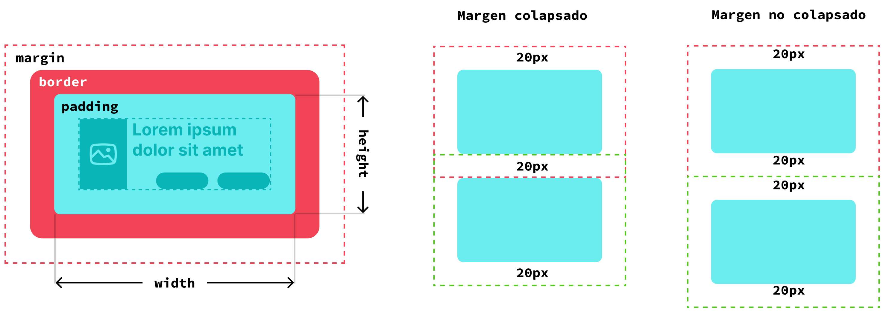
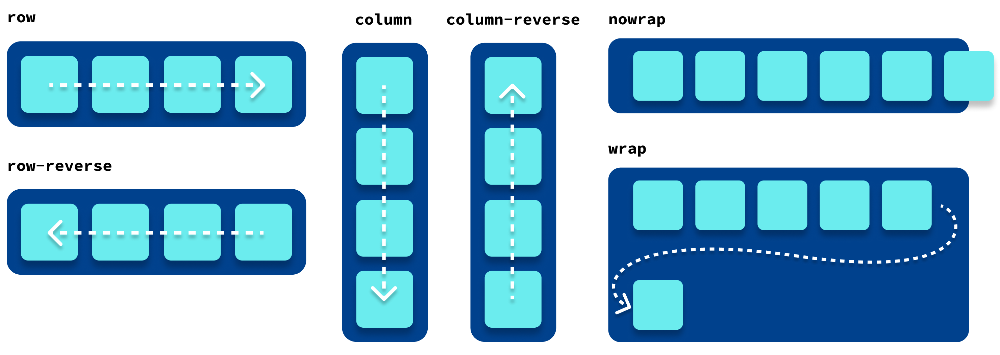

# Hojas de Estilo (CSS)

Después de definir la estructura con HTML, el paso siguiente es trabajar la dimensión visual de una interfaz. CSS permite decidir cómo se presentan los elementos, cómo se distribuyen en la pantalla y cómo responden a diferentes tamaños, estados y contextos de uso. En este capítulo se construye esa base visual y se introducen criterios de organización que serán centrales en el resto del libro.

## Objetivos del capítulo

- comprender cómo se vinculan selectores, propiedades, valores, cascada y especificidad;
- aplicar estilos básicos y de layout con criterios de legibilidad y mantenimiento;
- reconocer cuándo conviene usar Flexbox, Grid y responsive design según el problema;
- comenzar a organizar CSS pensando en reutilización, accesibilidad y escalabilidad.

## Introducción al CSS

CSS (Cascading Style Sheets, u Hojas de Estilo en Cascada) es un lenguaje fundamental en el desarrollo web, cuya función principal es definir la presentación visual de los documentos HTML. Mientras que HTML se encarga de la estructura y el contenido de una página, CSS permite controlar cómo se ven esos elementos: su disposición, colores, tipografías, márgenes, tamaños, animaciones y más. Gracias a CSS, el diseño web puede separarse del contenido, facilitando tanto el mantenimiento del sitio, la reutilización de estilos en múltiples páginas y el trabajo colaborativo en equipos interdisciplinarios.

El CSS fue propuesto por primera vez por Håkon Wium Lie en 1994, cuando trabajaba en el CERN junto con Tim Berners-Lee, creador de la Web. Por aquel entonces, los documentos HTML carecían de una forma estandarizada de definir estilos, lo que llevaba a una mezcla desordenada de contenido y presentación. La propuesta de Lie buscaba justamente eso: una manera de aplicar estilos de forma coherente y flexible, sin entorpecer el marcado semántico de las páginas.

Desde su aparición, CSS ha evolucionado significativamente. La primera versión oficial (CSS1) fue publicada en 1996 por el W3C (World Wide Web Consortium), seguida por CSS2 en 1998. Hoy en día, nos encontramos con CSS3, que no se presenta como una versión única, sino como un conjunto de módulos que avanzan de forma independiente (por ejemplo, Flexbox, Grid, Transitions, etc.). Esta modularización ha permitido una evolución más ágil y adaptable a las necesidades del diseño moderno.

En la actualidad, CSS se encuentra en el centro de varias tendencias importantes en el desarrollo web. Herramientas como Flexbox y CSS Grid han revolucionado la forma en que se diseñan interfaces, facilitando la creación de layouts complejos y adaptables. Además, tecnologías como CSS Variables, y animaciones nativas reflejan un lenguaje cada vez más poderoso y expresivo. También en los último años hubo una fuerte aceptación en el uso de frameworks, como Bootstrap, Tailwind y muchos más, que buscan mejorar la mantenibilidad y escalabilidad del código.

## Uso de CSS con HTML

CSS puede integrarse a un documento HTML de tres formas principales: en línea, con estilos internos y mediante un archivo externo. Cada método tiene sus usos, ventajas y desventajas.

**Estilo en línea:** Se aplica directamente al elemento HTML mediante el atributo `style`. Es útil para pruebas rápidas o estilos puntuales, pero no conviene como estrategia principal en proyectos grandes.

```html
<p style="color: red; font-weight: bold;">Este texto es rojo y en
negrita.</p>
```

**Estilo interno:** Se incluye dentro de una etiqueta `<style>` en el `<head>` del documento HTML. Es útil para páginas pequeñas o cuando se desea mantener todo en un solo archivo.

```html
<head>
<style>
h1 { color: blue; text-align: center; }
</style>
</head>
```

**Estilo externo:** Se vincula un archivo `.css` mediante la etiqueta `<link>` en el `<head>` del documento. Es la forma más recomendable para mantener un código limpio y reutilizable.

```html
<head>
<link rel="stylesheet" href="estilos.css">
</head>
```

El uso adecuado de estas formas permite separar contenido y presentación, lo cual facilita el mantenimiento y mejora la organización del sitio web.

## Código mantenible

Escribir CSS mantenible es clave para que un proyecto web pueda crecer sin volverse caótico. Un código claro, organizado y reutilizable permite que otros desarrolladores (o uno mismo en el futuro) puedan entender, modificar y escalar el diseño sin errores ni pérdidas de tiempo.

**Ejemplo de un código difícil de mantener**

```css
.red-text-bold-16 {
color: red; font-weight: bold;
font-size: 16px;
}
```

Este nombre mezcla estilos específicos y no se entiende qué representa semánticamente. Además, es difícil de reutilizar.

**Ejemplo de código bien pensado y fácil de mantener**

```css
.alert-message {
color: red;
font-weight: bold; font-size: 1rem;
}
```

Aquí, el nombre describe la función del elemento (mensaje de alerta), se usan unidades relativas, y los estilos pueden aplicarse a diferentes elementos con el mismo propósito.

Adoptar convenciones de nombres, evitar la repetición y separar responsabilidades son prácticas fundamentales para un CSS limpio y sostenible.

### **BEM: una metodología para escribir CSS mantenible**

A medida que los proyectos web crecen, también lo hacen los archivos CSS. Sin una organización clara, es fácil caer en definiciones confusas, estilos que se pisan entre sí o nombres difíciles de entender. Para evitar estos problemas, existen metodologías como BEM, que significa Bloque – Elemento – Modificador (Block – Element – Modifier).

BEM propone una convención de nombres clara y estructurada que permite escribir estilos predecibles y reutilizables. Se basa en tres conceptos:

**Bloque:** un componente independiente de la interfaz, como un botón, una tarjeta o un menú.

**Elemento:** una parte del bloque que no tiene sentido por sí sola, como el título de una tarjeta o un ítem dentro de un menú.

**Modificador:** una variante del bloque o elemento, como un color alternativo o un estado (activo, deshabilitado, etc.).

**Ejemplo en HTML y CSS**

```html
<div class="tarjeta tarjeta--destacada">
<h2 class="tarjeta__titulo">Curso de CSS</h2>
<p class="tarjeta__descripcion">
Aprendé a diseñar sitios web modernos.
</p>
</div>
```

```css
.tarjeta {
border: 1px solid #ccc;
padding: 1rem;
}
```

```css
.tarjeta--destacada {
border-color: #0066cc;
background-color: #f0f8ff;
}
```

```css
.tarjeta__titulo {
font-size: 1.5rem;
margin-bottom: 0.5rem;
}
```

```css
.tarjeta__descripcion {
color: #555;
}
```

Con BEM, los nombres son largos pero muy claros. Esto evita conflictos de estilos y facilita el trabajo en equipo, especialmente en proyectos grandes o cuando varios desarrolladores colaboran.

## Los selectores vinculan CSS con HTML

CSS funciona a través de reglas que se aplican a los elementos HTML. Cada regla tiene dos partes: un selector, que indica a qué elementos se debe aplicar el estilo, y un bloque de declaración, que define qué estilos se aplican. El selector es la base del CSS porque permite definir a qué elementos del HTML se vinculará cada declaración de CSS.

Por ejemplo, si se busca que todos los títulos `<h1>` de un documento HTML sean azules, se puede definir así:

```css
h1 {
color: blue;
}
```

Cuando el navegador interprete la página, aplicará las reglas de CSS al documento HTML según las coincidencias entre los selectores y los elementos del documento. Si encuentra una coincidencia, aplicará los estilos correspondientes.

Este sistema permite escribir reglas generales como lo que se demostró en el ejemplo con `h1`, o muy específicas, como darle formato sólo a un elemento en particular.

Existen diferentes tipos de selectores: por tipo de etiqueta, por clase, por ID, por atributo, combinadores e incluso pseudoclases. A medida que se combinan selectores, se gana mayor control sobre a qué parte del contenido se aplicarán los estilos definidos.

## Tipos básicos de selectores en CSS

En CSS, un selector es lo que usamos para decirle al navegador qué elementos del HTML deben recibir ciertos estilos. Los selectores permiten apuntar a elementos específicos o a grupos de elementos, y son la base de todo diseño en la web. A continuación, presentamos los tipos más comunes: elemento, clase, ID y atributo.

Antes de avanzar, conviene recordar una idea práctica: cuanto más claro sea el criterio con el que se nombran y seleccionan los elementos, más fácil será mantener el CSS. Un selector puede funcionar técnicamente y, sin embargo, volver confuso el archivo si no expresa bien la intención del código.

### **Selector de elemento (o de tipo)**

Este selector vincula directamente una etiqueta HTML. Se aplica a todos los elementos del mismo tipo.

```css
p {
font-size: 16px;
line-height: 1.5;
}
```

Este ejemplo aplica estilos a todos los párrafos `<p>` del documento. Es útil para establecer reglas generales.

### **Selector de clase**

El selector de clase utiliza un punto seguido de un texto que el desarrollador define, y que deberá coincidir con el valor del atributo class de los elementos HTML que se quiera afectar.

```css
.destacado {
background-color: yellow;
font-weight: bold;
}
```

```html
<p class="destacado">Este párrafo está destacado.</p>

<p> Este párrafo no está destacado, <span class="destacado">pero este
elemento dentro del párrafo</span>, sí.</p>
```

Las clases permiten reutilizar estilos en diferentes partes del sitio. Un mismo elemento HTML puede tener múltiples clases.

### **Selector de ID**

Usa el símbolo `#` seguido del valor del atributo `id` de los elementos HTML que se quiera seleccionar. A diferencia de las clases, un ID debe ser único dentro del documento.

**Nota:** debido al funcionamiento de HTML, que es un lenguaje no restrictivo, si hubiera más de un elemento con un mismo ID en el documento, la página seguirá funcionando igual y CSS seleccionará los dos elementos en el HTML (aunque es un tipo de situaciones que deberían evitarse, muchas veces ocurren).

```css
#encabezado-principal {
font-size: 2rem;
text-align: center;
}
```

```html
<h1 id="encabezado-principal">Bienvenidos</h1>
```

Los selectores por ID son más específicos, pero se recomienda usarlos con moderación en CSS para evitar problemas de sobrescritura de estilos.

### **Selector de atributo**

Este tipo de selector apunta a elementos que contienen un atributo específico o un valor determinado. Son mucho menos comunes de usar, pero muy importantes en algunos casos.

```css
input[type="email"] {
border: 1px solid #00f;
}
```

Este ejemplo aplica estilos solo a los campos de entrada de tipo email `<input type="email">`. Es útil para formularios y personalizaciones específicas sin agregar clases adicionales.

### **Pseudoclases y pseudoelementos**

Además de los selectores básicos, CSS ofrece más herramientas para aplicar estilos en situaciones específicas o a partes internas de los elementos. Estas herramientas son las pseudoclases y los pseudoelementos.

**Pseudoclases**

Las pseudoclases permiten aplicar estilos a un elemento cuando se encuentra en un estado particular o en una posición dentro del documento. Se escriben con dos puntos seguido del nombre del estado sobre el que se definirá el estilo (la pseudoclase).

```css
a:hover {
color: red;
}
```

Esta regla cambia el color de los enlaces cuando el usuario pasa el cursor sobre ellos. Es una forma sencilla de mejorar la interactividad sin agregar código adicional.

Otro caso frecuente:

```css
li:first-child {
font-weight: bold;
}
```

Aquí, el primer elemento de cada lista se mostrará en negrita, resaltando su importancia visual.

Existen muchísimas pseudoclases, en la documentación de la fundación Mozilla, puede consultarse la lista completa:  
[https://developer.mozilla.org/en-US/docs/Web/CSS/Pseudo-classes](https://developer.mozilla.org/en-US/docs/Web/CSS/Pseudo-classes) 

A continuación se resumen las más comunes:

`:hover`
Se activa cuando el usuario pasa el cursor sobre un elemento. Muy
utilizada para mejorar la interactividad, por ejemplo, en botones y
enlaces.

`:active`
Se aplica mientras el elemento está siendo activado, por ejemplo, el
tiempo en que se presiona un botón.

`:focus`
Se dispara cuando un elemento (como un input o un enlace) recibe el
foco, permitiendo mejorar la accesibilidad y la experiencia del
usuario en formularios y navegaciones mediante teclado.

`:first-child`
Selecciona el primer hijo de un elemento contenedor. Es útil para
aplicar estilos diferenciados al primer elemento de una lista o
sección.

`:last-child`
Similar a `:first-child`, este selector apunta al último hijo del
contenedor, permitiendo ajustar estilos de cierre o final.

`:checked`
Muy útil en formularios, permite estilizar elementos como casillas de
verificación y botones de radio cuando están seleccionados.

`:disabled`
Aplica estilos a elementos que están deshabilitados, por ejemplo,
campos de formulario o botones que no deben interactuarse.

**Pseudoelementos**

Los pseudoelementos permiten aplicar estilos a partes específicas de un elemento. Se escriben con doble dos puntos seguidos del nombre del pseudoelemento.

```css
p::first-line {
text-transform: uppercase;
}
```

Esta regla convierte en mayúsculas solo la primera línea de cada párrafo.

```css
p::before {
content: "→ ";
color: gray;
}
```

Inserta automáticamente una flecha gris al inicio de cada párrafo, sin modificar el contenido original del HTML.

Más información sobre pseudoelementos:  
[https://developer.mozilla.org/en-US/docs/Web/CSS/Pseudo-elements](https://developer.mozilla.org/en-US/docs/Web/CSS/Pseudo-elements) 

## Especificidad y cascada en CSS

La razón por la que CSS se llama Hojas de Estilo en Cascada (Cascading Style Sheets) está directamente relacionada con cómo el navegador decide qué estilos aplicar cuando hay múltiples reglas que apuntan al mismo elemento.

En el siguiente ejemplo ¿de qué color se verá el texto del párrafo definido en el HTML?

```css
.azul { color: blue; }
p { color: red; }
```

```html
<p class="azul">¿De qué color es este texto?</p>
```

La palabra "cascada" describe el proceso por el cual el navegador combina diferentes definiciones de estilos y resuelve conflictos entre reglas. Al igual que en una cascada real, donde el agua fluye desde distintos niveles y se va acumulando abajo, en CSS las reglas se van superponiendo unas sobre otras, y el navegador escoge cuál "gana" según una serie de criterios.

La cascada se basa en tres principios principales:

**Origen del estilo:** Los estilos del autor tienen más peso que los estilos predeterminados del navegador, que existen para mostrar el HTML incluso cuando no hay CSS definido por quien desarrolla.

**Especificidad:** Algunas reglas son más “específicas” que otras, y por lo tanto tienen prioridad.

**Orden de aparición:** Si dos reglas tienen la misma especificidad, gana la que aparece más abajo en el código.

**El uso de `!important`:**  
Como último recurso, esta declaración puede forzar que un estilo se aplique, incluso si otro tiene más especificidad.

**Especificidad**

La especificidad es una medida de cuán detallado o concreto es un selector. Cuanto más específico sea, mayor prioridad tendrá sobre otros.

Se calcula con un sistema de puntos que puede resumirse así:

| Tipo de selector | Puntaje | Ejemplos |
| :---- | ----- | :---- |
| elemento o tipo | 1 | `h1 // p // div // article` |
| clase, atributos y pseudoclases | 10 | `.clase // [type="text"] // :hover` |
| ID | 100 | `#id` |
| estilos en linea | 1000 | `style="color: red"` |

**Ejemplo 1: conflicto de estilos**

```css
p { color: blue; }
.verde { color: green; }
#principal { color: red; }
```

```html
<p id="principal" class="verde">Texto de ejemplo</p>
```

Aunque hay tres reglas que podrían aplicarse, gana `#principal` porque el selector por ID tiene mayor especificidad. Por lo tanto el párrafo tendrá color rojo.

**Ejemplo 2: misma especificidad**

```css
.titulo { font-size: 20px; }
.titulo { font-size: 24px; }
```

Ambas reglas tienen la misma especificidad (una clase), así que el navegador aplica la segunda, ya que está más abajo en el archivo CSS.

## Herencia en CSS

La herencia en CSS es un mecanismo que permite que ciertos estilos definidos en un elemento padre se transmitan automáticamente a sus elementos hijos. Este comportamiento refleja uno de los principios fundamentales de CSS: evitar la repetición de reglas y promover la escritura de código más limpio y eficiente.

No todas las propiedades CSS son heredables. Por defecto, las propiedades relacionadas con la presentación del texto, como color, font-family, font-size, line-height o letter-spacing, se heredan de forma natural. Esto significa que, si se definen en un elemento contenedor, los elementos descendientes adoptarán esos estilos a menos que se les indique lo contrario de forma explícita. En cambio, propiedades como margin, padding, border, width o background no se heredan automáticamente.

La herencia hace posible establecer estilos globales que se propaguen a lo largo del documento, simplificando la estructura del CSS y facilitando su mantenimiento. Además, CSS permite forzar la herencia mediante el valor inherit, lo que da mayor control cuando se quiere mantener coherencia visual en componentes más profundos del árbol del DOM.

El valor inherit en CSS permite forzar que una propiedad se herede del elemento padre, incluso si esa propiedad no es heredable por defecto. Es una herramienta útil cuando se desea mantener coherencia visual o comportamiento uniforme en elementos que, por naturaleza, no recibirían ciertos estilos automáticamente.

Propiedades como color o font-family se heredan naturalmente, sin embargo, otras como border, margin, padding o display no lo hacen. Si se desea que un elemento hijo copie exactamente el valor de una de estas propiedades desde su elemento padre, se puede usar inherit.

Esta instrucción le indica al navegador: “no uses el valor por defecto ni uno nuevo, simplemente copia lo que tiene el padre”.

Es especialmente útil cuando se trabaja con componentes o estructuras anidadas donde se quiere garantizar consistencia visual sin repetir estilos. También puede emplearse dentro de una regla para anular sobrescrituras accidentales o recuperar el estilo de un contenedor.

En el ejemplo, `<h1>` y `<p>` tendrán tipografía "Segoe UI", pero `<p>` tendrá color negro, mientras que `<h1>` será rojo.

```css
body {
font-family: 'Segoe UI', sans-serif;
color: black;
}
```

```css
h1 {
color: red;
}
```

```html
<body>
<main>
<article>
<h1>Primer título</h1>
<p>Párrafo dentro del primer artículo.</p>
</article>
<article>
<h1>Segundo título</h1>
<p>Párrafo dentro del segundo artículo.</p>
</article>
</main>
</body>
```

## Propiedades fundamentales del CSS

Esta sección explora las principales propiedades de CSS, esto incluye colores, tipografías y texto, elementos clave para establecer una identidad visual coherente y legible. Luego, continúa con el tratamiento de bordes, márgenes y padding, que permiten controlar el espacio y la disposición de los elementos en la página. También el uso de fondos e imágenes de fondo, recursos visuales que enriquecen la experiencia del usuario y añaden dinamismo al diseño. 

Finalmente, se detalla en las unidades de medida como px, em, rem, % y vw, fundamentales para lograr diseños flexibles, escalables y adaptables a distintos dispositivos. 

### **Colores, tipografías y texto**

El color en CSS se puede definir de diferentes maneras: mediante nombres en inglés (por ejemplo `red`), valores hexadecimales (por ejemplo `#FF0000`), mediante la función `rgb()` o también con `hsl()` y `rgba()` para incluir opacidad. Estas opciones permiten crear paletas armoniosas y accesibles. La tipografía se configura mediante propiedades como `font-family`, `font-size`, `font-weight` y `font-style`, lo que influye directamente en la legibilidad y la personalidad del sitio. Es común utilizar fuentes seguras para la web o importar tipografías desde servicios como Google Fonts. El manejo del texto incluye alineación (`text-align`), interlineado (`line-height`), transformación (`text-transform`), espaciado (`letter-spacing`, `word-spacing`) y decoración (`text-decoration`). Estas propiedades, combinadas, permiten dar estructura, jerarquía y claridad al contenido textual. Es fundamental mantener coherencia tipográfica en todo el sitio para mejorar la experiencia del usuario y facilitar la lectura, tanto en dispositivos móviles como en pantallas más grandes.

### **Bordes, márgenes y padding**

Los bordes, márgenes y padding son esenciales para controlar el espacio alrededor de los elementos HTML. El borde (border) define una línea visible en los contornos del elemento; puede personalizarse en grosor, estilo (solid, dashed, dotted, etc.) y color. El margen (margin) representa el espacio exterior entre un elemento y su entorno, permitiendo separar componentes entre sí. Por otro lado, el relleno o padding es el espacio interior entre el borde del elemento y su contenido. Estas propiedades se pueden aplicar individualmente (margin-top, padding-left, etc.) o de forma abreviada (margin: 10px 20px). Una correcta gestión de estos espacios mejora la legibilidad, la estética y la responsividad del sitio. También se utilizan en conjunto con modelos como el "box model", que representa gráficamente cómo se distribuyen y superponen estos espacios, siendo clave para un diseño web limpio y estructurado.



### **Fondos e imágenes de fondo**

Los fondos en CSS permiten aplicar colores sólidos o imágenes a los elementos HTML. La propiedad background-color define un color de fondo, mientras que background-image permite añadir imágenes. Esta imagen puede configurarse con propiedades como background-repeat (para repetir o no la imagen), background-position (para ubicarla), y background-size (para escalarla, por ejemplo con cover o contain). También se puede usar background-attachment para fijar la imagen al viewport. CSS permite aplicar múltiples fondos en capas, separándolos por comas. Además, background es una forma abreviada para definir varias de estas propiedades en una sola línea. El uso efectivo de fondos puede mejorar el diseño, reforzar la identidad visual y guiar la atención del usuario. Sin embargo, se debe tener cuidado con la legibilidad y el rendimiento del sitio, especialmente al usar imágenes pesadas o con contrastes que dificulten la lectura del contenido superpuesto.

### **Tamaños y unidades (px, em, rem, %, vw, etc.)**

CSS ofrece distintas unidades para definir tamaños y dimensiones, permitiendo crear diseños fijos o adaptables. px (píxeles) es una unidad absoluta y muy precisa, útil para elementos que requieren medidas exactas. em y rem son unidades relativas basadas en el tamaño de fuente: em se refiere al elemento actual, mientras rem al tamaño raíz (html). Son fundamentales para lograr escalabilidad tipográfica. Las unidades porcentuales (%) permiten definir dimensiones relativas al contenedor padre, útiles para diseños fluidos. Las unidades basadas en la ventana, como vw (viewport width) y vh (viewport height), son ideales para crear interfaces que se ajustan al tamaño de pantalla. Elegir la unidad adecuada es clave para un diseño adaptable y accesible. En proyectos modernos, se tiende a usar combinaciones de unidades relativas para facilitar la responsividad, mejorar la experiencia del usuario y mantener consistencia visual en diferentes dispositivos.

## Modelo de caja (Box Model)

Uno de los conceptos más importantes de CSS es el modelo de caja. Para el navegador, cada elemento visible de la página se representa como una caja rectangular. Esa caja está compuesta por cuatro zonas principales: el contenido, el relleno (`padding`), el borde (`border`) y el margen (`margin`).

Esto significa que incluso un elemento tan simple como un párrafo o una imagen ocupa más espacio del que aparenta a simple vista. El tamaño final de un elemento no depende solo de su ancho y alto, sino también del espacio interior y exterior que se le agregue.

Una forma simple de pensarlo es la siguiente:

- el contenido es lo que realmente muestra el elemento;
- el `padding` agrega aire entre el contenido y el borde;
- el `border` dibuja el contorno;
- el `margin` separa esa caja de otras cajas cercanas.

Por ejemplo:

```css
div {
width: 300px;
padding: 20px;
border: 2px solid #444;
margin: 30px;
}
```

En este caso, el contenido tendrá 300 píxeles de ancho, pero el tamaño visual total será mayor porque se suman el padding y el borde. Comprender esto es clave para evitar diseños que “se rompen” sin que parezca haber un error evidente.

### **Propiedades de visualización: display, visibility**

La propiedad `display` define cómo se comporta un elemento dentro del flujo de la página. Permite cambiar la forma en que ocupa espacio y cómo se relaciona con otros elementos.

Algunos valores muy usados son:

- `block`: el elemento ocupa todo el ancho disponible y comienza en una nueva línea;
- `inline`: el elemento ocupa solo el espacio necesario y no produce un salto de línea;
- `inline-block`: combina características de ambos, porque puede convivir en línea pero aceptar ancho y alto;
- `none`: oculta el elemento y lo elimina del flujo visual.

Por ejemplo:

```css
.etiqueta {
display: inline-block;
padding: 0.5rem 1rem;
background-color: #eee;
}
```

La propiedad `visibility` también oculta elementos, pero con una diferencia importante. Cuando se usa `visibility: hidden`, el elemento deja de verse, aunque sigue ocupando su lugar en el diseño. En cambio, con `display: none`, desaparece visualmente y además libera su espacio.

Esta diferencia es importante en interfaces donde se necesita mostrar u ocultar elementos sin modificar por completo la distribución del contenido.

### **box-sizing y su impacto**

Por defecto, CSS utiliza el valor `content-box`, lo que significa que el ancho y el alto definidos para un elemento solo se aplican al contenido. El `padding` y el `border` se suman aparte, aumentando el tamaño total de la caja.

Para evitar cálculos innecesarios y lograr diseños más predecibles, es común usar:

```css
* {
box-sizing: border-box;
}
```

Con `border-box`, el ancho y alto declarados incluyen también padding y border. Esto vuelve mucho más fácil construir layouts, especialmente cuando hay columnas, tarjetas o formularios con tamaños definidos.

En la práctica, la mayoría de los proyectos actuales adoptan `border-box` desde el inicio, porque reduce sorpresas y facilita el mantenimiento del CSS.

### **Overflow y scroll**

La propiedad `overflow` controla qué ocurre cuando el contenido de una caja es más grande que el espacio disponible.

Sus valores más frecuentes son:

- `visible`: el contenido se desborda y sigue viéndose;
- `hidden`: el contenido sobrante se recorta;
- `scroll`: siempre aparecen barras de desplazamiento;
- `auto`: las barras aparecen solo si hacen falta.

Por ejemplo:

```css
.descripcion {
max-height: 120px;
overflow: auto;
}
```

Este tipo de configuración es útil en tarjetas, paneles laterales o bloques de texto extensos. Sin embargo, debe usarse con criterio, porque un exceso de contenedores con scroll puede perjudicar la experiencia de lectura.

## Posicionamiento y maquetación

La maquetación es la forma en que se organizan visualmente los elementos dentro de una página. Durante mucho tiempo se resolvió con técnicas bastante limitadas, como `float` o posicionamiento manual. Hoy CSS ofrece herramientas mucho más robustas, especialmente Flexbox y Grid.

Antes de llegar a esas herramientas modernas, conviene entender cómo funciona el flujo normal del documento y qué sucede cuando empezamos a modificarlo con propiedades de posición.

## Tipos de posicionamiento

### **Estático, relativo, absoluto, fijo, sticky**

La propiedad `position` permite alterar el lugar que ocupa un elemento o la forma en que se referencia dentro de la página.

- `static`: es el comportamiento normal. El elemento permanece en el flujo del documento.
- `relative`: el elemento mantiene su lugar original, pero puede desplazarse respecto de sí mismo usando `top`, `right`, `bottom` o `left`.
- `absolute`: el elemento sale del flujo normal y se posiciona respecto del contenedor posicionado más cercano.
- `fixed`: el elemento queda fijado respecto de la ventana del navegador.
- `sticky`: combina el flujo normal con un comportamiento fijo a partir de cierto punto del scroll.

Ejemplo:

```css
.boton-flotante {
position: fixed;
bottom: 20px;
right: 20px;
}
```

El posicionamiento es muy útil, pero conviene no abusar de él para resolver diseños completos. En la mayoría de los casos, Flexbox y Grid ofrecen soluciones más limpias y mantenibles.

También conviene conocer `z-index`, una propiedad que permite controlar qué elementos quedan por encima de otros cuando se superponen. Su uso suele aparecer junto con `position`, especialmente en menús desplegables, encabezados fijos, modales o botones flotantes. Como regla general, conviene usarlo con moderación y solo cuando el problema de superposición esté claramente identificado.

### **Flotación**

Antes de la aparición de Flexbox y Grid, `float` fue una de las herramientas más utilizadas para acomodar elementos en columnas o hacer que una imagen “flotara” junto a un texto.

Por ejemplo:

```css
.imagen-miniatura {
float: left;
margin-right: 1rem;
}
```

Aunque sigue siendo útil en algunos casos puntuales, hoy no se recomienda usar `float` como técnica principal de maquetación. Sirve más como recurso histórico y como solución específica para ciertos comportamientos de texto e imagen.

## Flexbox

Flexbox es un sistema de distribución pensado para organizar elementos en una sola dimensión: fila o columna. Es ideal para barras de navegación, tarjetas alineadas, formularios y contenedores donde se necesita repartir espacio con flexibilidad.

Para activarlo se define `display: flex` sobre un contenedor:

```css
.menu {
display: flex;
justify-content: space-between;
align-items: center;
gap: 1rem;
}
```

Algunas propiedades fundamentales del contenedor son:

- `flex-direction`: define si los elementos se acomodan en fila o columna;
- `flex-wrap`: permite que los elementos pasen a la siguiente línea si no caben en una sola fila;
- `justify-content`: alinea sobre el eje principal;
- `align-items`: alinea sobre el eje secundario;
- `gap`: agrega espacio entre elementos.



En los hijos pueden usarse propiedades como `flex-grow`, `flex-shrink` y `flex-basis`, o la forma abreviada `flex`.

Ejemplo simple:

```css
.productos {
display: flex;
flex-wrap: wrap;
gap: 1rem;
}
```

```css
.producto {
flex: 1 1 250px;
}
```

Con esta configuración, los productos se acomodan en varias filas y cada tarjeta intenta medir al menos 250 píxeles antes de pasar a la siguiente línea.

### **Cómo pensar los ejes en Flexbox**

Uno de los errores más comunes al empezar con Flexbox es perder de vista que trabaja con dos ejes:

- el eje principal, que sigue la dirección definida por `flex-direction`;
- el eje secundario, que queda perpendicular al principal.

Si `flex-direction` vale `row`, el eje principal es horizontal. Si vale `column`, el eje principal pasa a ser vertical. Esta diferencia es importante porque `justify-content` siempre alinea sobre el eje principal, mientras que `align-items` lo hace sobre el secundario.

Por ejemplo:

```css
.panel {
display: flex;
flex-direction: column;
justify-content: center;
align-items: stretch;
min-height: 300px;
}
```

En este caso, los elementos se distribuyen verticalmente porque la dirección principal ahora es una columna.

### **Propiedades útiles en los hijos**

Además de las propiedades del contenedor, Flexbox ofrece herramientas para controlar el comportamiento de cada ítem.

- `flex-grow`: indica cuánto puede crecer un elemento si sobra espacio;
- `flex-shrink`: indica cuánto puede achicarse si falta espacio;
- `flex-basis`: define un tamaño base inicial antes de repartir o reducir;
- `align-self`: permite alinear un ítem de manera distinta al resto.

Por ejemplo:

```css
.barra {
display: flex;
gap: 1rem;
}

.barra__busqueda {
flex: 1 1 20rem;
}

.barra__acciones {
flex: 0 0 auto;
}
```

Aquí el campo de búsqueda puede ocupar el espacio disponible, mientras que el bloque de acciones conserva un tamaño más cercano a su contenido.

### **Qué significa realmente `flex: 1 1 250px`**

La notación abreviada `flex` suele resultar confusa al principio porque condensa tres decisiones en una sola línea:

- el primer valor indica si el elemento puede crecer (`flex-grow`);
- el segundo indica si puede achicarse (`flex-shrink`);
- el tercero define el tamaño base inicial (`flex-basis`).

Por eso, cuando se escribe:

```css
.producto {
flex: 1 1 250px;
}
```

se está diciendo que cada tarjeta:

- parte de una base de `250px`;
- puede crecer si sobra espacio;
- puede reducirse si falta espacio.

Este detalle es importante porque `flex-basis` no es exactamente lo mismo que `width`. En muchos casos se parecen, pero `flex-basis` participa directamente en el cálculo interno de Flexbox, mientras que `width` actúa como ancho del elemento. Cuando se quiere que un ítem entre en la lógica de reparto del contenedor, suele ser más claro usar `flex-basis`.

También conviene prestar atención a `flex-shrink`. Si no se controla, algunos elementos pueden comprimirse más de lo deseado cuando el espacio escasea. Por eso, en componentes como botones, logos o bloques con texto breve, a veces conviene impedir esa reducción:

```css
.logo {
flex: 0 0 auto;
}
```

Aquí el logo no crece, no se achica y conserva un tamaño gobernado por su contenido o por su ancho explícito.

### **Cuando hay varias líneas: `align-content`**

`align-items` y `justify-content` suelen alcanzar para muchos casos simples, pero cuando un contenedor usa `flex-wrap` aparece una propiedad adicional: `align-content`.

Esta propiedad distribuye el conjunto de líneas dentro del contenedor, no los ítems individuales. Solo tiene efecto cuando hay más de una línea.

```css
.galeria {
display: flex;
flex-wrap: wrap;
gap: 1rem;
align-content: start;
min-height: 500px;
}
```

Si en ese contenedor varias filas ocupan menos altura que la disponible, `align-content` permite decidir si esas filas quedan agrupadas arriba, centradas o repartidas en el espacio.

Una distinción útil es esta:

- `align-items` alinea los elementos dentro de cada línea;
- `align-content` alinea las líneas entre sí dentro del contenedor.

### **Reordenar no siempre significa mejorar**

Flexbox también permite cambiar visualmente el orden de los elementos mediante `order`.

```css
.destacado {
order: -1;
}
```

Esto puede ser útil en algunos componentes, pero conviene usarlo con cuidado. El orden visual no cambia necesariamente el orden semántico del HTML, y eso puede generar diferencias para lectores de pantalla o para la navegación con teclado. En general, si el orden del contenido es importante, conviene resolverlo primero en el HTML y usar `order` solo para ajustes puntuales.

### **Patrones frecuentes con Flexbox**

Flexbox aparece mucho en problemas pequeños pero muy habituales:

- centrar contenido dentro de un bloque;
- separar elementos hacia extremos opuestos;
- construir filas de tarjetas que se envuelven;
- alinear controles dentro de formularios o barras de herramientas.

Un patrón clásico es empujar un elemento hacia el extremo contrario con `margin-left: auto`:

```css
.nav {
display: flex;
align-items: center;
gap: 1rem;
}

.nav__login {
margin-left: auto;
}
```

Esto resulta muy útil para menús donde algunos enlaces quedan a la izquierda y una acción principal, como iniciar sesión, queda a la derecha.

También es habitual combinar `flex-wrap` con tamaños base razonables para lograr listados más robustos sin depender tanto de media queries.

## Grid Layout

CSS Grid está pensado para trabajar en dos dimensiones: filas y columnas al mismo tiempo. Es especialmente útil para construir layouts generales de página, galerías, dashboards y estructuras donde la relación entre áreas es más compleja.

Por ejemplo:

```css
.layout {
display: grid;
grid-template-columns: 240px 1fr;
gap: 1.5rem;
}
```

Aquí se construye un diseño con dos columnas: una más estrecha, útil para un menú lateral, y otra flexible para el contenido principal.

También pueden definirse varias columnas repetidas:

```css
.galeria {
display: grid;
grid-template-columns: repeat(3, 1fr);
gap: 1rem;
}
```

Grid facilita mucho la construcción de estructuras equilibradas, con menos hacks y más claridad que las técnicas clásicas.

### **Columnas flexibles con `repeat()` y `minmax()`**

Una de las mayores ventajas de Grid es que permite definir columnas que se adapten al espacio disponible sin tener que calcular manualmente cuántas entran.

Por ejemplo:

```css
.galeria {
display: grid;
grid-template-columns: repeat(auto-fit, minmax(220px, 1fr));
gap: 1rem;
}
```

Esta regla le dice al navegador que cree tantas columnas como entren, cada una con un mínimo de 220 píxeles y un máximo flexible de `1fr`. Es un patrón especialmente útil para tarjetas, galerías y listados de productos.

Conviene distinguir dos ideas:

- `repeat()` evita repetir la misma medida muchas veces;
- `minmax()` define un rango de tamaño posible para cada pista de la grilla.

### **`auto-fit` y `auto-fill`: parecidos, pero no iguales**

En ejemplos responsivos suele aparecer `repeat(auto-fit, minmax(...))`, pero existe una alternativa cercana: `auto-fill`.

Ambas permiten crear tantas columnas como entren en el espacio disponible. La diferencia es que `auto-fill` tiende a conservar pistas vacías si hay lugar para más columnas, mientras que `auto-fit` colapsa esas pistas vacías y reparte mejor el espacio entre las que sí tienen contenido.

En la práctica:

- `auto-fit` suele resultar más conveniente para tarjetas o productos que deben expandirse si sobran huecos;
- `auto-fill` puede ser útil cuando interesa conservar la estructura de la grilla aunque algunas celdas queden vacías.

No siempre se percibe la diferencia a simple vista, pero entenderla ayuda a elegir mejor el comportamiento responsivo de una galería o un listado.

### **Ubicar elementos en filas y columnas**

En Grid no solo importa cuántas columnas existen, sino también dónde se ubica cada elemento.

```css
.dashboard {
display: grid;
grid-template-columns: 240px 1fr;
grid-template-rows: auto 1fr auto;
gap: 1rem;
}

.dashboard__sidebar {
grid-column: 1 / 2;
grid-row: 1 / 4;
}

.dashboard__contenido {
grid-column: 2 / 3;
}
```

Este enfoque permite describir con bastante claridad qué ocupa cada zona. A diferencia de Flexbox, donde el orden lineal manda casi todo el comportamiento, Grid permite pensar la interfaz como una composición espacial.

También es frecuente que un elemento deba ocupar más de una columna o más de una fila. Para eso puede usarse la palabra clave `span`:

```css
.resumen {
grid-column: span 2;
}
```

Eso indica que el elemento debe extenderse a lo largo de dos columnas a partir de su posición actual. Es una forma muy práctica de destacar tarjetas, titulares o paneles dentro de una grilla.

### **Grilla explícita e implícita**

Cuando definimos `grid-template-columns` o `grid-template-rows`, estamos creando una grilla explícita. Sin embargo, Grid también puede crear pistas nuevas de manera automática si aparecen más elementos de los previstos o si algunos se ubican fuera de la estructura inicial.

Ese comportamiento forma parte de la grilla implícita.

```css
.listado {
display: grid;
grid-template-columns: repeat(3, 1fr);
grid-auto-rows: 180px;
gap: 1rem;
}
```

Aquí las columnas explícitas son tres. Si aparecen más elementos y hace falta crear nuevas filas, cada una de esas filas implícitas medirá `180px` gracias a `grid-auto-rows`.

También existen:

- `grid-auto-columns`, para definir el tamaño de columnas implícitas;
- `grid-auto-flow`, para decidir cómo se van ubicando automáticamente los elementos.

Por ejemplo:

```css
.paneles {
display: grid;
grid-template-columns: repeat(3, 1fr);
grid-auto-flow: row;
gap: 1rem;
}
```

Con `grid-auto-flow: row`, el navegador llena la grilla por filas, que es el comportamiento más habitual. También puede usarse `column` si interesa completarla por columnas, aunque es menos frecuente en interfaces generales.

### **Áreas nombradas para layouts más legibles**

Cuando el layout tiene regiones muy claras, `grid-template-areas` puede volver el CSS mucho más expresivo.

```css
.pagina {
display: grid;
grid-template-columns: 240px 1fr;
grid-template-areas:
"encabezado encabezado"
"menu contenido"
"pie pie";
gap: 1rem;
}

.pagina__encabezado { grid-area: encabezado; }
.pagina__menu { grid-area: menu; }
.pagina__contenido { grid-area: contenido; }
.pagina__pie { grid-area: pie; }
```

No siempre hace falta usar áreas nombradas, pero pueden ser muy convenientes en estructuras principales de página porque hacen más legible la intención del layout.

### **Alinear contenido dentro de una grilla**

Además de ubicar elementos, Grid permite controlar cómo se alinean dentro de sus celdas y cómo se distribuye la grilla completa en el espacio disponible.

```css
.metricas {
display: grid;
grid-template-columns: repeat(3, 1fr);
place-items: center;
gap: 1rem;
}
```

`place-items` es una forma abreviada de combinar `align-items` y `justify-items`, y resulta útil cuando todos los ítems deben alinearse de la misma manera.

También puede usarse `place-content` cuando lo que se quiere alinear no son los ítems dentro de cada celda, sino el conjunto de la grilla dentro del contenedor.

### **Patrones frecuentes con Grid**

Grid resulta especialmente útil cuando hace falta combinar estructura general y adaptabilidad.

Un caso común es el de dashboards o paneles donde algunas tarjetas ocupan más espacio que otras:

```css
.dashboard-resumen {
display: grid;
grid-template-columns: repeat(4, 1fr);
gap: 1rem;
}

.dashboard-resumen__principal {
grid-column: span 2;
}
```

Otro patrón muy frecuente es el de galerías o listados de productos que deben responder al ancho disponible sin depender de demasiados puntos de quiebre:

```css
.catalogo {
display: grid;
grid-template-columns: repeat(auto-fit, minmax(18rem, 1fr));
gap: 1rem;
}
```

En estos casos, Grid permite describir con bastante claridad tanto la estructura como el comportamiento responsive.

## ¿Cuándo usar Flexbox o Grid?

No se trata de elegir uno y descartar el otro. Ambas herramientas se complementan.

Flexbox suele ser la mejor opción cuando el problema principal es alinear o distribuir elementos en una sola dirección. Grid suele ser mejor cuando se necesita controlar filas y columnas al mismo tiempo.

Una regla práctica sencilla es esta:

- si estás organizando componentes en una fila o columna, pensá primero en Flexbox;
- si estás armando la estructura general de una pantalla o una grilla más compleja, pensá primero en Grid.

En muchos proyectos reales se usa Grid para el layout principal y Flexbox para organizar los componentes internos.

Dicho de otro modo: Flexbox suele resolver mejor problemas de distribución de contenido, mientras que Grid suele resolver mejor problemas de organización espacial.

Una forma útil de decidir es mirar qué pregunta domina el problema:

- si la pregunta es "¿cómo reparto estos elementos en una línea?", probablemente Flexbox sea suficiente;
- si la pregunta es "¿cómo organizo estas zonas en filas y columnas?", probablemente convenga Grid.
- si la pregunta es "¿necesito ambas cosas a la vez?", probablemente la solución más clara sea combinarlos.

Por ejemplo, un encabezado con logo, navegación y botón de acceso suele resolverse muy bien con Flexbox. En cambio, una portada con encabezado, barra lateral, contenido y pie de página suele ser más clara con Grid.

Esa combinación aparece muy seguido: Grid organiza la estructura principal de la pantalla y, dentro de cada bloque, Flexbox alinea botones, enlaces, formularios o pequeños grupos de elementos.

También conviene evitar una confusión frecuente: usar Grid para todo no vuelve automáticamente mejor un diseño, del mismo modo que intentar resolver un layout completo solo con Flexbox puede obligar a agregar demasiados contenedores intermedios. La elección depende del problema, no de cuál herramienta parece más moderna.

## Responsive Design

El diseño responsive busca que una interfaz pueda adaptarse a distintos tamaños de pantalla sin perder legibilidad ni usabilidad. Esto no significa hacer una versión distinta para cada dispositivo, sino construir un diseño flexible que responda a cambios de espacio disponible.

En la práctica, esto implica pensar en anchos fluidos, unidades relativas, imágenes flexibles y puntos de quiebre donde el diseño cambia de forma cuando hace falta.

### **Media queries**

Las media queries permiten aplicar reglas de CSS solo cuando se cumplen ciertas condiciones del dispositivo o de la ventana del navegador.

Por ejemplo:

```css
@media (max-width: 800px) {
.productos {
grid-template-columns: 1fr;
}
}
```

Esto indica que, cuando la pantalla tenga 800 píxeles de ancho o menos, la grilla de productos pasará a una sola columna.

Las media queries son uno de los recursos centrales del responsive design, pero no deberían reemplazar a un diseño flexible desde el principio. Primero conviene construir bien la base y luego ajustar los cambios necesarios.

### **Unidades relativas y diseño fluido**

Las unidades relativas como `%`, `em`, `rem`, `vw` y `vh` ayudan a que el diseño se adapte mejor a distintos contextos. A diferencia de valores rígidos como `px`, estas unidades permiten que el contenido escale o se reorganice con más naturalidad.

Algunas recomendaciones prácticas:

- usar `rem` para tipografía y espaciados generales;
- usar `%` para anchos relativos dentro de un contenedor;
- usar `vw` y `vh` con criterio, especialmente en elementos visuales amplios;
- evitar depender exclusivamente de tamaños fijos.

Un diseño fluido no es solo un diseño que “se achica”, sino uno que mantiene jerarquía visual y legibilidad al cambiar de tamaño.

### **Mobile First vs Desktop First**

Trabajar con enfoque mobile first significa comenzar diseñando para pantallas pequeñas y luego ampliar el diseño para pantallas mayores. Esta estrategia obliga a priorizar lo esencial: contenido, jerarquía, navegación y rendimiento.

Por ejemplo, se puede partir de una sola columna y luego agregar complejidad mediante media queries:

```css
.contenedor {
display: grid;
grid-template-columns: 1fr;
}
```

```css
@media (min-width: 900px) {
.contenedor {
grid-template-columns: 1fr 1fr;
}
}
```

En muchos proyectos actuales, mobile first resulta más práctico porque ayuda a construir interfaces más claras y ligeras desde el inicio.

### **Diseño adaptable vs diseño responsivo**

Aunque a veces se usan como sinónimos, no son exactamente lo mismo.

Un diseño adaptable suele definirse mediante varias versiones relativamente fijas que responden a ciertos tamaños concretos. Un diseño responsivo, en cambio, busca que la interfaz fluya y se reorganice con mayor continuidad.

En la práctica, muchos proyectos mezclan ambas estrategias. Lo importante no es la etiqueta, sino que el contenido siga siendo usable y claro en distintos tamaños de pantalla.

## Estilos avanzados

Una vez dominados los fundamentos, CSS ofrece herramientas para enriquecer el diseño y mejorar la expresividad visual de una interfaz. Estas propiedades no reemplazan a una buena estructura, pero permiten agregar identidad, jerarquía y respuesta visual.

### **Pseudo-elementos decorativos**

Los pseudo-elementos `::before` y `::after` permiten insertar contenido decorativo sin modificar el HTML. Son útiles para iconos simples, separadores, etiquetas visuales o pequeños detalles de diseño.

Ejemplo:

```css
.precio::before {
content: "$";
color: #2f6b2f;
font-weight: bold;
}
```

Conviene usarlos con criterio: son muy útiles para decoración, pero no deberían cargar información esencial que luego no pueda ser interpretada correctamente por otras herramientas.

### **Variables en CSS**

Las variables de CSS, también llamadas custom properties, permiten definir valores reutilizables dentro de una hoja de estilos. Son especialmente útiles para colores, espaciados, tipografías o tamaños repetidos.

Ejemplo:

```css
:root {
--color-primario: #2f6b2f;
--color-secundario: #f7f4ea;
}
```

```css
.boton {
background-color: var(--color-primario);
color: white;
}
```

Esto simplifica mucho el mantenimiento, porque un cambio en una variable puede propagarse a muchos componentes sin reescribir cada regla.

### **Animaciones y transiciones**

Las transiciones permiten suavizar cambios entre estados visuales. Son muy útiles en botones, enlaces, tarjetas y menús.

Ejemplo:

```css
.boton {
transition: background-color 0.3s ease, transform 0.3s ease;
}
```

```css
.boton:hover {
background-color: #245224;
transform: translateY(-2px);
}
```

Las animaciones, en cambio, permiten secuencias más complejas usando `@keyframes`. Aunque son potentes, conviene usarlas con moderación y evitar movimientos innecesarios que puedan distraer o afectar accesibilidad.

### **Filtros y efectos visuales**

CSS permite aplicar filtros sobre imágenes u otros elementos visuales con propiedades como `filter`. Entre los valores más usados están `blur()`, `grayscale()`, `brightness()` o `contrast()`.

Ejemplo:

```css
.imagen-deshabilitada {
filter: grayscale(100%);
}
```

Estos efectos pueden ser útiles para comunicar estados, pero no deberían convertirse en el único medio para transmitir información importante.

### **Sombras y degradados**

Las sombras y degradados son recursos clásicos para agregar profundidad y contraste visual.

Por ejemplo:

```css
.tarjeta {
box-shadow: 0 8px 20px rgba(0, 0, 0, 0.08);
background: linear-gradient(180deg, #ffffff, #f7f7f7);
}
```

Usados con moderación, ayudan a construir interfaces más claras. Si se exageran, pueden recargar el diseño y volverlo menos legible.

## Organización y buenas prácticas

Un archivo CSS pequeño puede mantenerse casi sin esfuerzo, pero a medida que un proyecto crece, la organización se vuelve decisiva. La claridad en nombres, estructura y responsabilidades evita conflictos y facilita el trabajo en equipo.

### **Reutilización de estilos**

Conviene escribir estilos pensando en patrones que puedan repetirse. Botones, tarjetas, formularios, alertas o contenedores suelen beneficiarse de reglas reutilizables en lugar de definiciones aisladas para cada caso.

Reutilizar no significa hacer todo genérico, sino identificar comportamientos y apariencias que se repiten para no escribir el mismo CSS una y otra vez.

### **Convenciones de nombres** 

Las convenciones de nombres ayudan a mantener consistencia. BEM es una de las más difundidas, pero no es la única. También existen enfoques como SMACSS o estilos utility-first.

Más importante que seguir una metodología específica es sostener una convención coherente a lo largo del proyecto. Los nombres deberían comunicar intención y facilitar la lectura del código.

### **Separación por archivos**

Cuando el proyecto empieza a crecer, suele ser útil separar el CSS por responsabilidades. Una organización frecuente podría ser:

- `reset.css` o `normalize.css`, para reducir diferencias entre navegadores;
- `base.css`, para tipografía, colores generales y estilos base;
- `layout.css`, para estructura general;
- `components.css`, para botones, tarjetas, formularios y otros bloques reutilizables.

No existe una única forma correcta de organizar archivos, pero sí conviene evitar hojas de estilo enormes y desordenadas que mezclen todo sin criterio.

## Accesibilidad

Aunque la accesibilidad tendrá un módulo específico más adelante, CSS también influye de forma directa en la experiencia de personas que navegan con diferentes condiciones o tecnologías de asistencia.

Algunos criterios importantes en esta etapa son:

- mantener contraste suficiente entre texto y fondo;
- no eliminar indicadores de foco sin reemplazarlos por una alternativa visible;
- no depender solo del color para comunicar un estado;
- evitar animaciones excesivas o molestas;
- cuidar tamaños de fuente e interlineado.

Por ejemplo, una mala práctica común es eliminar el foco de los enlaces o botones con `outline: none;` sin ofrecer una alternativa. Si se modifica el foco, debe seguir siendo claramente visible.

## Optimización

Optimizar CSS no significa solo “hacerlo más corto”, sino también lograr que sea más claro, más mantenible y más eficiente.

Algunas prácticas recomendables son:

- evitar selectores innecesariamente complejos;
- reutilizar clases y variables;
- eliminar estilos muertos o duplicados;
- agrupar reglas relacionadas con criterio;
- minimizar archivos en entornos de producción.

También existen herramientas de auditoría como Lighthouse o los paneles del navegador que ayudan a revisar rendimiento, accesibilidad y organización general del sitio.

En proyectos pequeños, la optimización más importante suele ser la claridad. En proyectos grandes, además de eso, conviene atender peso final de archivos, carga de fuentes e imágenes y complejidad de las hojas de estilo.

## El futuro del CSS

CSS sigue evolucionando de forma constante. Muchas de las herramientas que hoy parecen básicas, como Flexbox, Grid o las variables, en otro momento fueron novedades. Lo mismo ocurre actualmente con características nuevas como subgrid, container queries, mejoras en selectores y funciones cada vez más expresivas.

Esto no significa que haya que perseguir cada novedad apenas aparece. Lo importante es construir una base sólida y luego incorporar herramientas nuevas cuando realmente resuelven mejor un problema.

En este libro, el objetivo no es cubrir todas las posibilidades del lenguaje, sino dejar una base suficientemente firme para que el crecimiento posterior tenga sentido.

## Proyecto guiado: dar estilo al sistema de supermercado

El mismo proyecto trabajado en HTML puede utilizarse ahora para practicar CSS de forma progresiva.

Una posible secuencia de trabajo sería:

- definir una paleta básica de colores para el sitio;
- establecer tipografías, tamaños y espaciados generales;
- diseñar el formulario de `carga.html`;
- dar formato a la `ficha.html` como una página de producto;
- convertir `lista.html` en una tabla legible y ordenada;
- reorganizar portada, tarjetas y navegación con Flexbox o Grid;
- incorporar media queries para mejorar la experiencia en pantallas pequeñas.

Este proyecto es útil porque permite practicar no solo propiedades aisladas, sino también jerarquía visual, consistencia, reutilización de estilos y adaptación responsive.

## Validación y recursos recomendados para CSS

Al trabajar con CSS conviene revisar no solo si el sitio “se ve lindo”, sino también si resulta legible, consistente y adaptable.

Algunas preguntas útiles para revisar el propio trabajo son:

- ¿la jerarquía visual ayuda a entender el contenido?
- ¿los espacios entre elementos son consistentes?
- ¿el contraste de color permite leer bien el texto?
- ¿el diseño sigue funcionando cuando cambia el tamaño de pantalla?
- ¿las clases y nombres usados ayudan a mantener el código?

Recursos recomendados para profundizar:

- MDN CSS: [https://developer.mozilla.org/es/docs/Web/CSS](https://developer.mozilla.org/es/docs/Web/CSS)
- web.dev Learn CSS: [https://web.dev/learn/css/](https://web.dev/learn/css/)
- MDN Layout Cookbook: [https://developer.mozilla.org/en-US/docs/Web/CSS/Layout_cookbook](https://developer.mozilla.org/en-US/docs/Web/CSS/Layout_cookbook)
- Guía de Flexbox en CSS-Tricks: [https://css-tricks.com/snippets/css/a-guide-to-flexbox/](https://css-tricks.com/snippets/css/a-guide-to-flexbox/)
- Guía de Grid en CSS-Tricks: [https://css-tricks.com/snippets/css/complete-guide-grid/](https://css-tricks.com/snippets/css/complete-guide-grid/)
- Can I Use: [https://caniuse.com/](https://caniuse.com/)

Con esto queda cubierta la base visual del desarrollo frontend. A esta altura, ya debería poder leer reglas de CSS con más criterio, distinguir por qué ciertos diseños funcionan mejor que otros y aplicar decisiones básicas de layout, responsive design y organización del código.

El próximo paso será trabajar con herramientas que ayudan a organizar y escalar mejor las hojas de estilo, comenzando por los preprocesadores CSS.

## Ejercicios del capítulo

### Comprensión

1. Explique con sus palabras la diferencia entre selector, declaración, propiedad y valor en CSS.
2. Describa qué relación existe entre cascada, especificidad y orden de aparición.
3. Explique cuándo conviene pensar primero en Flexbox y cuándo conviene pensar primero en Grid.

### Aplicación

1. Tome una página HTML simple y aplíquele estilos externos para definir tipografía, colores, espaciados y una jerarquía visual básica.
2. Construya un listado de productos responsive que use Flexbox o Grid y cambie su disposición entre pantallas pequeñas y grandes.
3. Diseñe una barra de navegación con Flexbox que incluya logo, enlaces y un botón alineado al extremo derecho. Explique qué propiedades del contenedor y de los hijos utilizó.
4. Arme una galería de tarjetas con Grid usando `repeat()` y `minmax()`. Pruebe cómo cambia al achicar y agrandar la ventana del navegador.

### Integración

1. Aplique CSS al proyecto del supermercado para diseñar `carga.html`, `ficha.html` y `lista.html` con una identidad visual coherente. Registre qué decisiones tomó en relación con colores, espaciado, layout y adaptación responsive.
2. Rediseñe la portada o la página de listado del proyecto del supermercado combinando Grid para la estructura principal y Flexbox para los componentes internos. Justifique por qué eligió cada herramienta en cada parte.
